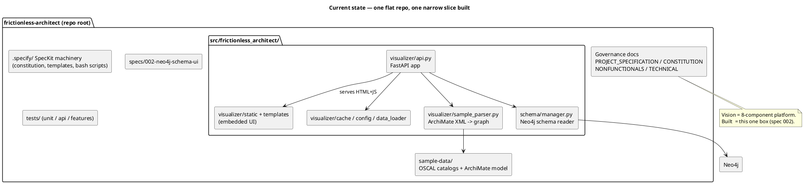
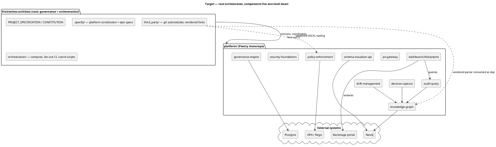
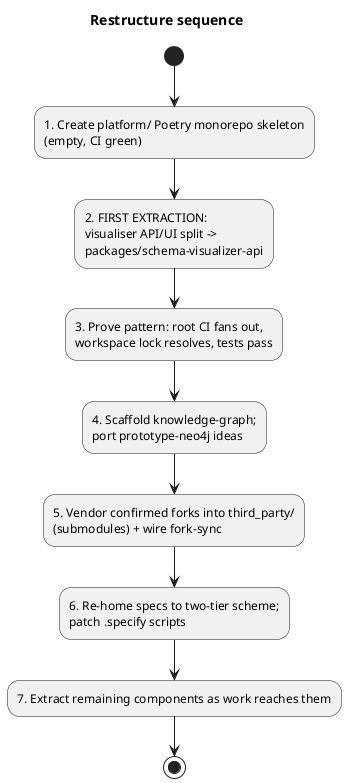
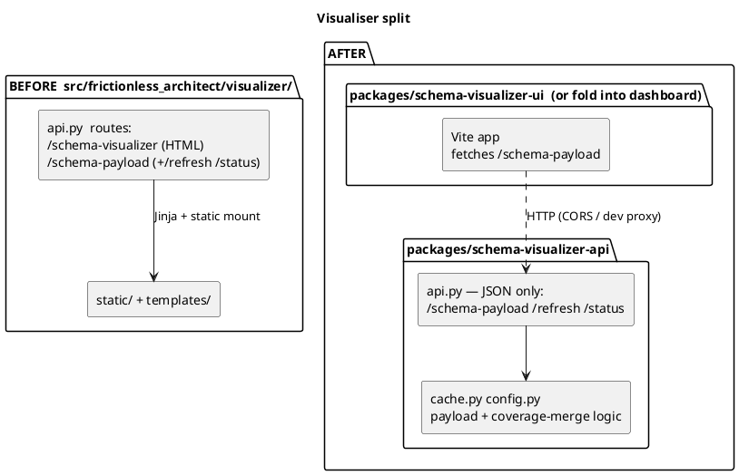

# Repository Architecture & Topology

Canonical description of how this repository is structured and the target it is being
restructured toward. Read alongside `PROJECT_SPECIFICATION.md` (the product vision),
`PROJECT_CONSTITUTION.md`, and `TECHNICAL.md`.

**Status:** target adopted; migration in progress (see §8).

The load-bearing decisions behind this document — and the platform's other
decisions gleaned from the specs, constitution, and `TECHNICAL.md` — are now
recorded as individual MADR records under [`docs/adr/`](docs/adr/README.md).
This document remains the narrative; the ADR log is the decision index.

---

## 1. Principle

All application code lives **one level below** the repository root. The root is a thin
**governance / orchestration layer**: vision, constitution, cross-cutting specs,
coordination scripts, submodule pointers, and the CI that fans out to components. It holds
**no application code**.

This is a packaging decision only. The product vision in `PROJECT_SPECIFICATION.md` — an
8-component Frictionless Architecture & Governance Platform automating APRA CPS 230 / 234
compliance — is unchanged. The spec's "single-user, locally run MVP" line is treated as an
early scoping compromise, not a constraint on the topology.

---

## 2. Current state



**Branch → state matrix:**

| Branch | Spec | Impl | Notes |
|---|---|---|---|
| `main` | 002 only | visualiser only | baseline |
| `develop` | 002 only | visualiser only | ≈ main + 2 commits (dotenv override, debug logging) |
| `001-governance-platform` | full spec + `contracts/api.yaml` | **none** | |
| `002-arch-kg-semantics` | SpecKit template stub | none | never fleshed out |
| `prototype-neo4j` | — | KG model, DB seeding, ArchiMate layers, forensic ledger | not merged, exploratory |
| `feat/oscal-sample-data` | — | sample data only | current branch |

---

## 3. Target state

### 3.1 Shape

- **Root repo = governance + orchestration only. Zero application code.**
- **First-party components live as packages in a single Poetry monorepo**
  (`platform/`). One tree, per-package `pyproject.toml`, one shared `poetry.lock`,
  independent build/publish.
- **Vendored upstream forks are git submodules under `third_party/`, and only there.**
  They are low-touch (rebased customisation branch, periodic `fork-sync`), so submodule
  pointer-churn is acceptable. Never a submodule for actively-developed first-party code.
- **Frontend(s)** are packages too — a `pnpm`/Vite sub-tree inside the same monorepo, not
  a separate repo, until JS weight demands `turborepo`.

### 3.2 Target directory layout

```
frictionless-architect/                 # ROOT — governance & orchestration
├── PROJECT_SPECIFICATION.md             # vision (stays)
├── PROJECT_CONSTITUTION.md              # platform constitution
├── ARCHITECTURE.md  NONFUNCTIONALS.md  TECHNICAL.md
├── .specify/                            # PLATFORM SpecKit: constitution + epic templates
├── specs/                               # EPIC / cross-cutting specs only  (see §6)
│   └── EPIC-xxx-.../
├── orchestration/
│   ├── compose/                         # docker-compose for Neo4j + Postgres + OPA (dev)
│   └── scripts/                         # cross-component coordination
├── third_party/                        # git submodules — vendored forks ONLY
│   ├── <archimate-parser-fork>/
│   └── <oscal-tooling-fork>/
└── platform/                            # the Poetry monorepo (the "level below")
    ├── pyproject.toml                   # root project; packages/* as path dependencies
    ├── poetry.lock                      # single shared lock
    └── packages/
        ├── governance-engine/           # component 1
        ├── pii-gateway/                 #   (1.2 — split candidate)
        ├── knowledge-graph/             # component 2
        ├── decision-capture/            # component 3
        ├── policy-enforcement/          # component 4
        ├── drift-management/            # component 5
        ├── audit-query/                 # component 6
        ├── dashboard/                   # component 7 — Vite/pnpm sub-tree
        ├── security-foundations/        # component 8 (largely cross-cutting lib)
        └── schema-visualizer-api/       # first extraction (from today's src/)
```

Each `packages/<name>/` carries its own `pyproject.toml`, `src/`, `tests/`, `README.md`,
and `specs/` (per-component feature specs — see §6).

### 3.3 Target diagram



---

## 4. Component → package mapping

Components are the eight from `PROJECT_SPECIFICATION.md` "Proposed Grouping".

| # | Component | Home | Build vs wrap | Notes |
|---|---|---|---|---|
| 1 | Core Governance Service + PII handling | `packages/governance-engine` (+ optional `packages/pii-gateway`) | **build** | Python CLI/service, Specify lifecycle. PII gateway may split later — one package to start. |
| 2 | Architecture Knowledge Graph & Semantic Model | `packages/knowledge-graph` | **build**, wraps forked ArchiMate parser | Absorbs today's `schema/manager.py`, `sample_parser.py`; port `prototype-neo4j` seeding ideas (§7). |
| 3 | AI-Assisted Decision Capture & Attestation | `packages/decision-capture` | **build** | ADR gen, conflict detection, sign-off. Attestation *UI* belongs to dashboard (7). |
| 4 | Automated Policy & Compliance Enforcement | `packages/policy-enforcement` | **build**, wraps OPA + forked OSCAL tooling | CPS 230 / 234. The OSCAL sample-data work belongs here. |
| 5 | Real-Time Monitoring & Drift Management | `packages/drift-management` | **build** | Drift detect, Break-Glass, managed-drift tickets. |
| 6 | Compliance Audit & Query Interface | `packages/audit-query` | **build** | Traceability matrix + NL-to-graph. Backend for dashboard queries. |
| 7 | Architecture Governance Dashboard | `packages/dashboard` | **build** (Vite, pnpm sub-tree) | Backstage-embedded target unconfirmed — see §10. |
| 8 | Security Foundations | `packages/security-foundations` | **build** (mostly a shared lib) | RBAC/ABAC, encryption helpers, threat-model scanning. Consumed by all others. |
| — | Schema Visualiser API (today's `visualizer/`) | `packages/schema-visualizer-api` | **build** | First extraction. Its embedded UI folds into `dashboard` or ships as a small `schema-visualizer-ui` package. |

**Forks to vendor** (`third_party/`, submodules) — *candidates, not confirmed*:

- An ArchiMate Exchange Format / `.archimate` parser (consumed by `knowledge-graph`).
- OSCAL tooling — catalog resolution / component-definition handling (consumed by
  `policy-enforcement`); the `sample-data/oscal/*.puml` resolution artefacts imply a
  resolver is already in the loop.

Confirm the exact upstreams before creating submodules.

---

## 5. Monorepo tooling

**Poetry** for the first-party Python packages — the tool the repo already uses.
`uv` was evaluated and is **not adopted**: `uv sync` failed repeatedly in this
environment, and there is no benefit large enough to justify migrating a working
build off Poetry. Revisit only if Poetry's monorepo story becomes a real drag.

| Option | Verdict | Why |
|---|---|---|
| **Poetry monorepo** | **Chosen** | Already in use (`poetry-dynamic-versioning`, commitizen, `poetry.lock`). Root `pyproject.toml` aggregates `packages/*` as path dependencies; each package keeps its own `pyproject.toml` and build backend; one shared `poetry.lock`. No migration cost. |
| `uv` workspace | On hold | Faster resolver and a native workspace model, but `uv sync` broke repeatedly here and migrating every `pyproject.toml` + the versioning setup buys little today. Re-evaluate if that changes. |
| `pnpm` + `turborepo` | Later, if JS grows | Right tool once `dashboard` + shared UI libs justify a task graph. Nest a pnpm workspace under `packages/dashboard*` now; promote only when needed. |
| Meta-repo tool (`meta`, `mu-repo`, `git-subrepo`) | No | Solves polyrepo coordination we are deliberately avoiding for first-party code. |
| Submodules for everything | No | Pointer-commit churn makes day-to-day multi-package dev miserable. Forks only. |
| Nx | No | JS-first; heavier than the Python weight warrants. |

**Multi-package layout under Poetry:** `platform/pyproject.toml` is the root project;
each `packages/<name>/` is a Poetry project depending on its siblings via path
dependencies (`{ path = "../knowledge-graph", develop = true }`). Dynamic versioning
and the commitizen config move to the root and target the whole tree. No build-backend
churn — packages keep the current setup.

---

## 6. Spec numbering (two-tier)

Current: flat `specs/NNN-*` across the whole platform — `001-governance-platform`,
`002-neo4j-schema-ui`, `002-arch-kg-semantics` (already a collision).

Target:

- **Root `specs/`** holds only **epic / cross-cutting** specs, prefixed `EPIC-`:
  e.g. `specs/EPIC-001-platform-restructure/`, `specs/EPIC-002-cps230-234-traceability/`.
- **Each `packages/<name>/specs/`** restarts its own `NNN-` sequence, scoped to that
  component: e.g. `packages/knowledge-graph/specs/001-neo4j-schema-ui/`.
- **Existing specs re-home as:**
  - `001-governance-platform` → `EPIC-001`, or retire in favour of
    `PROJECT_SPECIFICATION.md` + per-component specs (§10).
  - `002-neo4j-schema-ui` → `packages/schema-visualizer-api/specs/001-*`
    (and/or `packages/knowledge-graph/specs/001-*`).
  - `002-arch-kg-semantics` (stub) → `packages/knowledge-graph/specs/002-*`, or delete.
- **`.specify/scripts/bash/`** (`create-new-feature.sh`, `setup-plan.sh`,
  `update-agent-context.sh`, `check-prerequisites.sh`) assume one repo / one `specs/`.
  Add a `--package <name>` arg that targets `packages/<name>/specs/` — one source of
  truth, rather than per-package copies.
- Root keeps `.specify/memory/constitution.md` as the **platform** constitution;
  per-component constitutions are optional lighter addenda (§10).

---

## 7. `prototype-neo4j` disposition

Branch has: KG model, UNWIND bulk seeding, ArchiMate business/motivation layers,
layer-scoped visualisers, forensic ledger / KG planes. Diverged early → more rewrite than
cherry-pick.

Treat it as a **reference, not a merge source**. When `packages/knowledge-graph` is
scaffolded, port the model + seeding ideas deliberately into the new structure. Tag the
branch `archive/prototype-neo4j` before it rots. Do not block the restructure on it.

---

## 8. Migration sequence



### 8.1 First extraction — visualiser API/UI split

Today one FastAPI app (`visualizer/api.py`) serves both JSON and the HTML/JS UI
(`static/schema_visualizer.js`, `templates/schema_visualizer.html`).



Checklist:
- Move `visualizer/{api,cache,config}.py` + the visualiser's own payload /
  coverage-merge logic + the FastAPI router into
  `packages/schema-visualizer-api/src/`.
- `data_loader.py` (Neo4j read), `sample_parser.py`, and `schema/manager.py` are
  **not** part of this step — their home is deferred to the `knowledge-graph`
  extraction (see ADR-0005 → Amendment 2026-08-30, and §4).
- Drop the HTML route + Jinja/static mounts from `api.py`; keep `/schema-payload*`.
- Move `static/` + `templates/` into a Vite project; replace the server-rendered bootstrap
  with a `fetch('/schema-payload')` call; add a dev proxy.
- Add CORS config to the API (same-origin today, so none).
- `tests/api/*` and the visualiser-owned `tests/unit/visualizer/*` move with the
  package; `test_data_loader.py` / `test_sample_parser.py` follow their code to
  `knowledge-graph`.
- Keep the `FRICTIONLESS_ARCHITECT_` env prefix as-is for this extraction; rename is its
  own epic (§9).
- Entry point `uvicorn frictionless_architect.visualizer:app` →
  `uvicorn schema_visualizer_api:app`; update `quickstart.md` / `README.md`.

---

## 9. Cross-cutting migration risks

- **`FRICTIONLESS_ARCHITECT_` env prefix + `frictionless_architect` package name** —
  referenced across `config.py`, docs, `.env*`. Any rename is its own epic; do not fold it
  into a component extraction.
- **Splitting the single `pyproject.toml` into per-package projects** (§5) touches the
  commitizen / dynamic-versioning setup and every package's path dependencies.
- **`.specify/` bash scripts** need the `--package` arg before per-component specs work.
- **SonarQube / SonarCloud / Snyk** config (`sonar-project.properties`, `.sonar/`,
  `.sonarlint/`) is single-project — needs per-package `sonar.projectKey`s or a monorepo
  Sonar setup.
- **`tests/features/` (behave)** + `[tool.behave]` + `[tool.pytest.ini_options]`
  `testpaths` are root-absolute — re-home per package.
- **CI** (`.github/`) assumes one package; needs a matrix/fan-out over workspace members.

---

## 10. Open questions

1. Does anything ever leave the monorepo for its own repo, or is "package forever" the
   rule? (Leaning: package forever; split only if a component is open-sourced standalone.)
2. Root `.specify/` as the platform constitution with lighter per-component constitutions
   beneath, or one constitution only?
3. Dashboard: Backstage-embedded plugin, or standalone SPA? Changes package 7's build shape.
4. Which upstreams get forked (ArchiMate parser? which OSCAL tool?).
5. Does `pii-gateway` start as its own package or split out of `governance-engine` later?
6. `001-governance-platform` spec: promote to `EPIC-001`, or retire in favour of
   `PROJECT_SPECIFICATION.md` + per-component specs?
7. Keep `src/frictionless_architect/` importable as an umbrella namespace package during
   the transition, or hard-cut per extraction?
8. Does `schema-visualizer-api` consume `knowledge-graph` as a path-dependency library
   (its own Neo4j connection, per §3.3) or over HTTP? (Blocks the first extraction —
   ADR-0005 Amendment.)
9. Is `sample_parser.py` visualiser-specific or generic ArchiMate ingestion? If generic
   it moves to `knowledge-graph` with the forked parser (§4) and the API package stays thin.

---

## 11. Locked decisions

- Restructuring is aligned with the original vision; proceed. Not a pivot.
- Root repo = governance / orchestration, **zero application code**.
- First-party code → **one Poetry monorepo** (`platform/`). Forks → **git
  submodules under `third_party/` only**.
- **Package manager is Poetry, not `uv`** (`uv sync` broke repeatedly in this env).
- **Visualiser API/UI split is the first extraction.**
