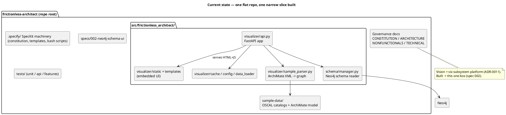
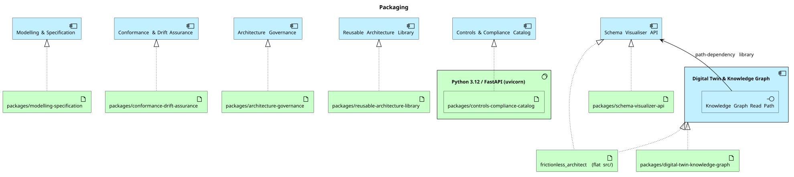
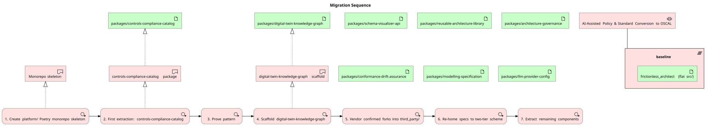
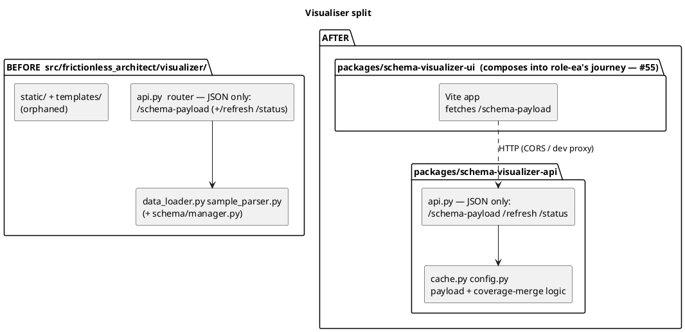

# Repository Architecture & Topology

Canonical description of how this repository is structured and the target it is being
restructured toward. Read alongside `specs/001-governance-platform/spec.md` (the business specification),
`.specify/memory/constitution.md` (the platform constitution), and `TECHNICAL.md`.

**Status:** target adopted; migration in progress (see §8).

The load-bearing decisions behind this document — and the platform's other
decisions gleaned from the specs, constitution, and `TECHNICAL.md` — are now
recorded as individual MADR records under [`docs/adr/`](docs/adr/README.md).
This document remains the narrative; the ADR log is the decision index.

---

## 1. Principle

All application code lives **one level below** the repository root. The root is a thin
**governance / orchestration layer**: vision, constitution, cross-cutting specs,
coordination scripts, submodule pointers, and the CI that fans out to components. It holds
**no application code**.

This is a packaging decision only. The product vision in `specs/001-governance-platform/spec.md` — a
Frictionless Architecture & Governance Platform automating APRA CPS 230 / 234 compliance —
is unchanged; its decomposition is the six subsystems of
[ADR-0011](docs/adr/0011-six-subsystem-decomposition.md), modelled in `architecture/model/`. The
"single-user, locally run MVP" target
([ADR-0024](docs/adr/0024-single-user-local-mvp.md)) is treated as an early scoping compromise, not a
constraint on the topology.

---

## 2. Current state


```plantuml
@startuml
title Current state — one flat repo, one narrow slice built
skinparam componentStyle rectangle

package "frictionless-architect (repo root)" {
  [Governance docs\nCONSTITUTION / ARCHITECTURE\nNONFUNCTIONALS / TECHNICAL] as docs
  [.specify/ SpecKit machinery\n(constitution, templates, bash scripts)] as speckit
  [specs/002-neo4j-schema-ui] as spec002

  package "src/frictionless_architect/" {
    [visualizer/api.py\nFastAPI app] as api
    [visualizer/static + templates\n(embedded UI)] as ui
    [visualizer/cache / config / data_loader] as vsupport
    [visualizer/sample_parser.py\nArchiMate XML -> graph] as parser
    [schema/manager.py\nNeo4j schema reader] as schema
  }

  [sample-data/\nOSCAL catalogs + ArchiMate model] as sampledata
  [tests/ (unit / api / features)] as tests
}

[Neo4j] as neo4j
api --> ui : serves HTML+JS
api --> vsupport
api --> schema
schema --> neo4j
api --> parser
parser --> sampledata

note bottom of docs
  Vision = six-subsystem platform (ADR-0011).
  Built  = this one box (spec 002).
end note
@enduml
```

**Branch → state matrix:**

| Branch | Spec | Impl | Notes |
|---|---|---|---|
| `main` | 002 only | visualiser only | baseline |
| `develop` | 002 only | visualiser only | ≈ main + 2 commits (dotenv override, debug logging) |
| `001-governance-platform` | full spec + `contracts/api.yaml` | **none** | |
| `002-arch-kg-semantics` | SpecKit template stub | none | never fleshed out |
| `prototype-neo4j` | — | KG model, DB seeding, ArchiMate layers, forensic ledger | not merged, exploratory |
| `feat/oscal-sample-data` | — | sample data only | current branch |

---

## 3. Target state

### 3.1 Shape

- **Root repo = governance + orchestration only. Zero application code.**
- **First-party components live as packages in a single Poetry monorepo**
  (`platform/`). One tree, per-package `pyproject.toml`, one shared `poetry.lock`,
  independent build/publish.
- **Vendored upstream forks are git submodules under `third_party/`, and only there.**
  They are low-touch (rebased customisation branch, periodic `fork-sync`), so submodule
  pointer-churn is acceptable. Never a submodule for actively-developed first-party code.
- **Each subsystem ships its own UI** ([ADR-0020](docs/adr/0020-per-subsystem-uis.md)) —
  a `ui/` `pnpm` sub-tree beside its `api/`, inside the same monorepo, not a separate repo,
  until JS weight demands `turborepo`. There is no central dashboard package; composition
  is server-composed per role journey, not a client-side shell or Backstage plugins
  (ADR-0020); build tooling for the `ui/` trees remains open (#55).

### 3.2 Target directory layout

```text
frictionless-architect/                 # ROOT — governance & orchestration
├── ARCHITECTURE.md  NONFUNCTIONALS.md  TECHNICAL.md
├── .specify/                            # PLATFORM SpecKit: constitution + epic templates
├── specs/                               # EPIC / cross-cutting specs only  (see §6)
│   └── EPIC-xxx-.../
├── orchestration/
│   ├── compose/                         # docker-compose for Neo4j (+ Postgres / OPA if kept) — target through MVP (ADR-0018)
│   └── scripts/                         # cross-component coordination
├── third_party/                        # git submodules — vendored forks ONLY
│   ├── <archimate-parser-fork>/
│   └── <oscal-tooling-fork>/
└── platform/                            # the Poetry monorepo (the "level below")
    ├── pyproject.toml                   # root project; packages/* as path dependencies
    ├── poetry.lock                      # single shared lock
    └── packages/
        ├── controls-compliance-catalog/     # subsystem 1  (each: api/ + ui/, ADR-0020)
        ├── reusable-architecture-library/   # subsystem 2
        ├── digital-twin-knowledge-graph/    # subsystem 3
        ├── architecture-governance/         # subsystem 4
        ├── conformance-drift-assurance/     # subsystem 5
        ├── modelling-specification/         # subsystem 6
        ├── schema-visualizer-api/           # from today's src/, after step 4 (§8)
        └── llm-provider-config/             # shared, not a subsystem (ADR-0034)
```

Each `packages/<name>/` carries its own `pyproject.toml`, `src/`, `tests/`, `README.md`,
and `specs/` (per-package feature specs — see §6). Not every package is one of the six
subsystems: a capability needed by more than one of them gets its own sibling package
instead of being duplicated per subsystem or dumped in a catch-all `common`
([ADR-0034](docs/adr/0034-shared-packages-and-llm-provider-config.md)); the first
instance is `llm-provider-config` (§4).

### 3.3 Target diagram

Packages as ArchiMate Artifacts realising the subsystems they ship, deployed onto the
shared runtime (`sw-uvicorn-fastapi`/`node-app-server`), in an *Implementation and
Deployment* viewpoint (`architecture/model/` `view-packaging`, GH #55). Generated from
`architecture/model/`, never hand-drawn (constitution Principle X); `node-app-server`
itself is not a member — the viewpoint's allowed-concept list excludes `Node` (see the
view's own comment in `views.yaml`).

[](architecture/model/diagrams/implementation/packaging.svg)

§3.2 gives the package layout in prose; the generated C4 container view
([`container.svg`](architecture/model/diagrams/c4/container.svg)) gives the logical one.

---

## 4. Subsystem → package mapping

The six subsystems are those of [ADR-0011](docs/adr/0011-six-subsystem-decomposition.md),
modelled in `architecture/model/` (section B). Each package holds an `api/` and a `ui/`
([ADR-0020](docs/adr/0020-per-subsystem-uis.md)).

<!-- pyml disable md013 -->
| # | Subsystem | Home | Build vs wrap | Notes (absorbs, from the old 8-component grouping) |
|---|---|---|---|---|
| 1 | Controls & Compliance Catalog | `packages/controls-compliance-catalog` | **build**, wraps `compliance-trestle` | Policy/standard documents → OSCAL Catalogs and Profiles (AI-assisted Markdown, Trestle round-trip). Consumes the vendored OSCAL reference content; the OSCAL sample-data work belongs here. **First extraction** (§8.1, ADR-0005). |
| 2 | Reusable Architecture Library | `packages/reusable-architecture-library` | **build** | Patterns, blueprints, solution designs, candidate options, and threat modelling of them (old 8.3, the user-facing part). |
| 3 | Digital Twin & Knowledge Graph | `packages/digital-twin-knowledge-graph` | **build**, wraps forked ArchiMate parser | Old 2 + old 6: the intent and twin planes, the forensic ledger, and querying them (traceability matrix, NL-to-graph). Absorbs today's `schema/manager.py`, `sample_parser.py`; port `prototype-neo4j` seeding ideas (§7). |
| 4 | Architecture Governance | `packages/architecture-governance` | **build** | Old 3: option evaluation, impact assessment, ADR generation, conflict detection, attestation sign-off (and its UI). |
| 5 | Conformance & Drift Assurance | `packages/conformance-drift-assurance` | **build**, wraps OPA (ADR-0019, Proposed) | Old 4 + old 5: release-gate control enforcement (CPS 230 / 234), BAU effectiveness monitoring, drift detection, Break-Glass, remediation tickets. |
| 6 | Modelling & Specification | `packages/modelling-specification` | **build** | ArchiMate / C4 / UML modelling and executable-spec generation from the knowledge graph. |
| — | Schema Visualiser API (today's `visualizer/`) | `packages/schema-visualizer-api` | **build** | Extracted after the knowledge-graph scaffold (§8.2, ADR-0005). Its UI composes into `role-ea`'s journey, not a standalone dashboard (ADR-0005/0020, #55). |
<!-- pyml enable md013 -->

**Not packages** — parts of the old grouping that ADR-0011 dropped or dissolved:

- **Specify lifecycle CLI** (old 1.1) — this repo's development tooling (`.specify/`), not a
  platform component. Distinct from subsystem 6's executable-spec generation.
- **PII anonymization gateway** (old 1.2, ADR-0014) — scope undecided (#56).
- **Security foundations** (old 8) — RBAC and encryption are platform requirements every
  subsystem meets (`specs/001` FR-016 / FR-017, `NONFUNCTIONALS.md`); scanning the platform's
  own as-built state is an operational NFR (`NONFUNCTIONALS.md` "Security Assessments",
  formerly FR-018); threat modelling as an output is subsystem 2.
- **Dashboard** (old 7) — replaced by per-subsystem UIs (ADR-0020).

**Shared packages (not subsystems)** — a capability needed by more than one subsystem
package, built and gated the same way but carrying no subsystem UI obligation
([ADR-0034](docs/adr/0034-shared-packages-and-llm-provider-config.md)):

- **LLM Provider Configuration** (`packages/llm-provider-config`) — resolves which LLM
  provider/model/params and credential a call uses: a global default plus an optional
  per-component override, covering OpenAI, Google Gemini, Anthropic Claude, Ollama and GitHub Copilot via
  `litellm`. Credentials are never written to a repo file or `.env` — they live in the
  OS's native credential store via `keyring` (macOS Keychain / Windows Credential
  Manager / Linux Secret Service), falling back to the provider's environment variable
  (with a logged warning) where there is no keychain, e.g. CI or headless hosts;
  consistent with the single-user local MVP scope (ADR-0024). Exposes a mountable settings page/router each subsystem UI embeds, not a
  standalone dashboard (ADR-0020). First consumer: `controls-compliance-catalog`'s
  `llm_client.py`.

**Forks to vendor** (`third_party/`, submodules) — *candidates, not confirmed*:

- An ArchiMate Exchange Format / `.archimate` parser (consumed by `digital-twin-knowledge-graph`).

**OSCAL** is resolved (see [ADR-0030](docs/adr/0030-vendor-oscal-reference-content.md)):
NIST/FedRAMP reference content (`usnistgov/OSCAL`, `usnistgov/oscal-content`,
`GSA/fedramp-automation`) is vendored as plain `third_party/` submodules, consumed by
`controls-compliance-catalog` when it's built; `compliance-trestle` (the catalog/profile
authoring and round-trip tool) is an ordinary Poetry dependency, not a submodule.

Confirm the exact ArchiMate-parser upstream before creating that submodule.

---

## 5. Monorepo tooling

**Poetry** for the first-party Python packages — the tool the repo already uses.
`uv` was evaluated and is **not adopted**: `uv sync` failed repeatedly in this
environment, and there is no benefit large enough to justify migrating a working
build off Poetry. Revisit only if Poetry's monorepo story becomes a real drag.

<!-- pyml disable md013 -->
| Option | Verdict | Why |
|---|---|---|
| **Poetry monorepo** | **Chosen** | Already in use (`poetry-dynamic-versioning`, commitizen, `poetry.lock`). Root `pyproject.toml` aggregates `packages/*` as path dependencies; each package keeps its own `pyproject.toml` and build backend; one shared `poetry.lock`. No migration cost. |
| `uv` workspace | On hold | Faster resolver and a native workspace model, but `uv sync` broke repeatedly here and migrating every `pyproject.toml` + the versioning setup buys little today. Re-evaluate if that changes. |
| `pnpm` + `turborepo` | Later, if JS grows | Right tool once the per-subsystem `ui/` trees + shared UI libs justify a task graph. Nest a pnpm workspace under `packages/*/ui` now; promote only when needed. |
| Meta-repo tool (`meta`, `mu-repo`, `git-subrepo`) | No | Solves polyrepo coordination we are deliberately avoiding for first-party code. |
| Submodules for everything | No | Pointer-commit churn makes day-to-day multi-package dev miserable. Forks only. |
| Nx | No | JS-first; heavier than the Python weight warrants. |
<!-- pyml enable md013 -->

**Multi-package layout under Poetry:** `platform/pyproject.toml` is the root project;
each `packages/<name>/` is a Poetry project depending on its siblings via path
dependencies (`{ path = "../digital-twin-knowledge-graph", develop = true }`). Dynamic versioning
and the commitizen config move to the root and target the whole tree. No build-backend
churn — packages keep the current setup.

---

## 6. Spec numbering (two-tier)

Current: flat `specs/NNN-*` across the whole platform — `001-governance-platform`,
`002-neo4j-schema-ui`, `002-arch-kg-semantics` (already a collision).

Target:

- **Root `specs/`** holds only **epic / cross-cutting** specs, prefixed `EPIC-`:
  e.g. `specs/EPIC-001-platform-restructure/`, `specs/EPIC-002-cps230-234-traceability/`.
- **Each `packages/<name>/specs/`** restarts its own `NNN-` sequence, scoped to that
  component: e.g. `packages/digital-twin-knowledge-graph/specs/001-neo4j-schema-ui/`.
- **Existing specs re-home as:**
  - `001-governance-platform` → `EPIC-001` (it is the platform's business specification
    since `PROJECT_SPECIFICATION.md` was retired — §10 Q6).
  - `002-neo4j-schema-ui` → `packages/schema-visualizer-api/specs/001-*`
    (and/or `packages/digital-twin-knowledge-graph/specs/001-*`).
  - `002-arch-kg-semantics` (stub) → `packages/digital-twin-knowledge-graph/specs/002-*`, or delete.
- **`.specify/scripts/bash/`** (`create-new-feature.sh`, `setup-plan.sh`,
  `check-prerequisites.sh`) assume one repo / one `specs/`.
  Add a `--package <name>` arg that targets `packages/<name>/specs/` — one source of
  truth, rather than per-package copies.
- Root keeps `.specify/memory/constitution.md` as the **platform** constitution;
  per-component constitutions are optional lighter addenda (§10).

---

## 7. `prototype-neo4j` disposition

Branch has: KG model, UNWIND bulk seeding, ArchiMate business/motivation layers,
layer-scoped visualisers, forensic ledger / KG planes. Diverged early → more rewrite than
cherry-pick.

Treat it as a **reference, not a merge source**. When `packages/digital-twin-knowledge-graph` is
scaffolded, port the model + seeding ideas deliberately into the new structure. Tag the
branch `archive/prototype-neo4j` before it rots. Do not block the restructure on it.

---

## 8. Migration sequence

1. Create `platform/` Poetry monorepo skeleton (empty, CI green).
2. **First extraction:** `packages/controls-compliance-catalog`, home of the policy-to-OSCAL
   pipeline (#44) (§8.1).
3. Prove pattern: root CI fans out, workspace lock resolves, tests pass.
4. Scaffold `digital-twin-knowledge-graph`; port `prototype-neo4j` ideas (§7).
5. Vendor confirmed forks into `third_party/` (submodules) + wire `fork-sync`.
6. Re-home specs to the two-tier scheme; patch `.specify` scripts (§6).
7. Extract remaining components as work reaches them — including the visualiser API/UI
   split (§8.2), now that step 4 has delivered the read path it consumes.

The steps are modelled in `architecture/model/` section E as Work Packages, with the
packages each delivers, the Baseline / Transition / Target Plateaus, and the Gaps
between them (GH #65):

[](architecture/model/diagrams/migration/sequence.svg)

The order puts each package after the packages it consumes — see the
[packaging view](architecture/model/diagrams/implementation/packaging.svg) (ADR-0005, #60).

**Status:** steps 1–3 done (#71). `platform/` has its own `pyproject.toml` and
`poetry.lock`; `packages/controls-compliance-catalog` is an empty, installable package.
`scripts/platform_checks.sh` gates every package under `platform/packages/` (lock check,
pyright, mypy, pytest at 90% coverage). The pre-commit and pre-merge scripts, the
pre-push hook and CI all call it, and Sonar and Codecov pick up its coverage. The repo
root keeps its own project and lock for the flat `src/` until step 7 empties it.

### 8.1 First extraction — controls-compliance-catalog

The policy-to-OSCAL pipeline (#44) is new code, so it is written straight into
`packages/controls-compliance-catalog` instead of into today's flat `src/` and moved later.
It reads only the vendored framework packs — no dependency on
`digital-twin-knowledge-graph` — so it proves the pattern (step 3) without waiting on
step 4. It needs the `platform/` skeleton (step 1) first.

Checklist:

- [x] Create `packages/controls-compliance-catalog/` with its own `pyproject.toml`, `src/`,
  `tests/`, `README.md`, and `specs/` (§3.2, §6); add it to the `platform/` workspace (#71).
- [x] Re-target `specs/003-oscal-ai-conversion` at this package, re-homed as
  `specs/001-oscal-ai-conversion` (it planned an `/oscal` router in the flat `src/`,
  ADR-0005 → Implementation status 2026-09-24 and 2026-09-28).
- [ ] Build #44 outside-in inside the package: UI with stubs → stubbed API → backend.
- [x] Create `packages/llm-provider-config/` (ADR-0034) and refactor `llm_client.py`'s
  single-provider stub to depend on it for provider/model/credential resolution (#76).
  The mountable settings UI router is built (`create_settings_router`) and mounted by
  `controls-compliance-catalog` at `/settings/llm`; a portal can mount the same router later.

### 8.2 Visualiser API/UI split (step 7)

Today the visualiser is JSON only: its router (`visualizer/api.py`) serves `/schema-payload*`
from the shared FastAPI app in `frictionless_architect/app.py`. The server-rendered HTML
route was dropped on 2026-09-13, leaving `visualizer/static/` and `templates/` orphaned
(ADR-0005 → Implementation status).


```plantuml
@startuml
title Visualiser split
skinparam componentStyle rectangle

package "BEFORE  src/frictionless_architect/visualizer/" {
  [api.py  router — JSON only:\n/schema-payload (+/refresh /status)] as before_api
  [data_loader.py sample_parser.py\n(+ schema/manager.py)] as before_kg
  [static/ + templates/\n(orphaned)] as before_ui
  before_api --> before_kg
}

package "AFTER" {
  package "packages/schema-visualizer-api" {
    [api.py — JSON only:\n/schema-payload /refresh /status] as after_api
    [cache.py config.py\npayload + coverage-merge logic] as after_lib
    after_api --> after_lib
  }
  package "packages/schema-visualizer-ui  (composes into role-ea's journey — #55)" {
    [Vite app\nfetches /schema-payload] as after_ui
  }
  after_ui ..> after_api : HTTP (CORS / dev proxy)
}
@enduml
```

Checklist:

- Move `visualizer/{api,cache,config}.py` + the visualiser's own payload /
  coverage-merge logic + the FastAPI router into
  `packages/schema-visualizer-api/src/`.
- `data_loader.py` (Neo4j read), `sample_parser.py`, and `schema/manager.py` are
  **not** part of this step — they move to `packages/digital-twin-knowledge-graph`, which
  `schema-visualizer-api` consumes as a path-dependency library, not over HTTP (ADR-0005,
  §4).
- ~~Drop the HTML route + Jinja/static mounts; keep `/schema-payload*`.~~ Done 2026-09-13.
- Build the UI as a Vite app that calls `fetch('/schema-payload')`, with a dev proxy;
  delete the orphaned `visualizer/static/` and `templates/`.
- Add CORS config to the API (same-origin today, so none).
- `tests/api/*` and the visualiser-owned `tests/unit/visualizer/*` move with the
  package; `test_data_loader.py` / `test_sample_parser.py` follow their code to
  `digital-twin-knowledge-graph`.
- Keep the `FRICTIONLESS_ARCHITECT_` env prefix as-is for this extraction; rename is its
  own epic (§9).
- Entry point `uvicorn frictionless_architect.app:app` →
  `uvicorn schema_visualizer_api:app`; update `README.md`.

---

## 9. Cross-cutting migration risks

- **`FRICTIONLESS_ARCHITECT_` env prefix + `frictionless_architect` package name** —
  referenced across `config.py`, docs, `.env*`. Any rename is its own epic; do not fold it
  into a component extraction.
- **Splitting the single `pyproject.toml` into per-package projects** (§5) touches the
  commitizen / dynamic-versioning setup and every package's path dependencies.
- **`.specify/` bash scripts** need the `--package` arg before per-component specs work.
- **SonarQube / SonarCloud / Snyk** config (`sonar-project.properties`, `.sonar/`,
  `.sonarlint/`) is single-project — needs per-package `sonar.projectKey`s or a monorepo
  Sonar setup.
- **`tests/features/` (behave)** + `[tool.behave]` + `[tool.pytest.ini_options]`
  `testpaths` are root-absolute — re-home per package.
- **CI** (`.github/`) assumes one package; needs a matrix/fan-out over workspace members.

---

## 10. Open questions

1. Does anything ever leave the monorepo for its own repo, or is "package forever" the
   rule? (Leaning: package forever; split only if a component is open-sourced standalone.)
2. Root `.specify/` as the platform constitution with lighter per-component constitutions
   beneath, or one constitution only?
3. *Resolved (ADR-0020, 2026-09-27):* per-subsystem UI composition is server-composed
   per role journey, neither Backstage plugins nor a client-side shell app. Build tooling
   for each `ui/` tree remains open (#55).
4. Which upstream gets forked for the ArchiMate Exchange Format parser? (OSCAL tooling
   is resolved — see ADR-0030: vendored reference content + a plain `compliance-trestle`
   dependency, not a fork.)
5. Is collaboration-tool decision capture still in scope, and where does the PII gateway
   (ADR-0014, narrowed by ADR-0031) sit? (#56)
6. *Resolved 2026-09-26:* `001-governance-platform` becomes `EPIC-001` (ADR-0004, §6).
   `PROJECT_SPECIFICATION.md` was retired instead, so spec 001 is the platform's business
   specification (constitution v1.3.0).
7. Keep `src/frictionless_architect/` importable as an umbrella namespace package during
   the transition, or hard-cut per extraction?
8. *Resolved (ADR-0005):* `schema-visualizer-api` consumes `digital-twin-knowledge-graph`
   as a path-dependency library, not over HTTP, until a second consumer needs that interface.
9. *Resolved (ADR-0005):* `sample_parser.py` is generic ArchiMate ingestion, so it moves to
   `digital-twin-knowledge-graph` (§4) and the API package stays thin.
10. *Resolved (ADR-0005):* the visualiser split moves after the
    `digital-twin-knowledge-graph` scaffold, and `controls-compliance-catalog` — which has
    no knowledge-graph dependency — becomes the first extraction (§8, #60).

---

## 11. Locked decisions

- Restructuring is aligned with the original vision; proceed. Not a pivot.
- Root repo = governance / orchestration, **zero application code**.
- First-party code → **one Poetry monorepo** (`platform/`). Forks → **git
  submodules under `third_party/` only**.
- **Package manager is Poetry, not `uv`** (`uv sync` broke repeatedly in this env).
- **`controls-compliance-catalog` (policy-to-OSCAL) is the first extraction; the
  visualiser API/UI split follows the knowledge-graph scaffold** (ADR-0005).
