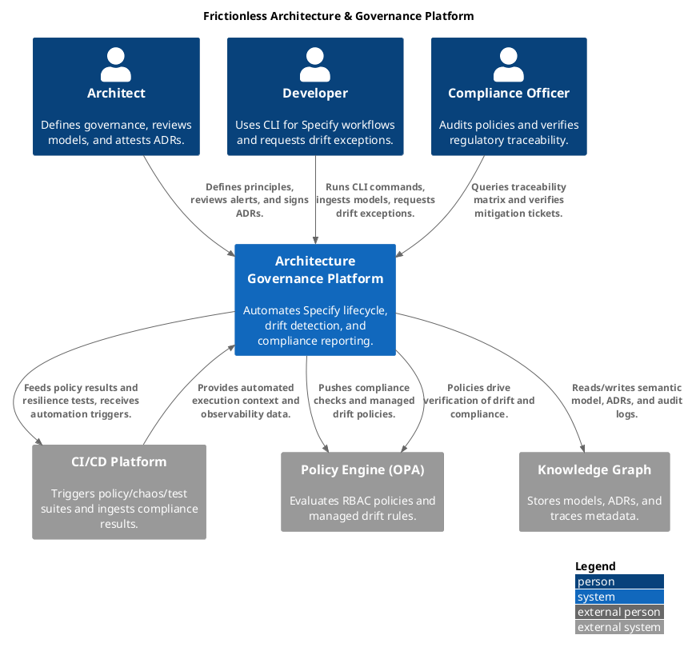

# Business Functional Requirements

Use this document as background input when drafting new `/specs/[###-feature-name]/spec.md` files; do not edit this file directly except to document historical context.

*See .specify/memory/constitution.md for the current canonical reference and keep executable plans under specs/[###-feature-name]/.*

This document outlines the key business features and input/output formats, the focus is on functionality from a user's perspective, with some architectural insights for context.

**MVP Target:** Deliver a single-user, locally run application that supports the functiosn and workflows described below without requiring multi-user or hosted infrastructure.

## Feature Inventory

- Supports the ArchiMate 3.2 metamodel
- Drag out every element/relationship
- Use the magic connector to snap appropriate relationships
- Add user-defined properties
- Support ArchiMate exchange format
- Simple creation of ArchiMate Views/Viewpoints
- Drop in aligned concepts, and instantly get a tailored perspective of the overall architecture.
- Hints view that explains every element, relationship, and viewpoint in-context so new modellers always know what to pick next.
- Visualiser that renders the selected element plus all its inbound/outbound relationships in a radial tree, keeping the navigation tree, diagram selection, and visualiser in sync so you can “connect the dots.”

## UI Overview

- Traditional multi-pane desktop IDE
- Model Tree on the left houses packages of elements, views and folders, with inline search/filter controls and context menus for creating sub-folders, diagrams and properties
- Right-hand tabbed View Editor draws whatever ArchiMate view or canvas you open, and the palette lives beside the canvas so dragging a figure automatically adds the matching element to the model tree while shared properties stay in sync.
- The palette/toolbar selection covers element types, notes, connectors and blocks, while the Properties Window (opened via the Window menu or double-clicking an element) lets you adjust semantics, appearance and hints for the active selection; views open in tabs so you can keep several diagrams or sketches layered without switching windows.
- Supplementary panes include the Visualiser (radial relationship map of the current selection), Navigator/Model Tree linkage (selection syncing), and Hints window that explains each ArchiMate viewpoint or canvas block; together they help clarify what can be dropped on a diagram and how elements relate without leaving the main layout.
- Sketch View and the Canvas Modelling Toolkit sit beside the traditional diagrams, offering sticky-note brainstorming, reusable canvas templates (e.g., Business Model Canvas), background images, locked blocks, and hints; these appear in the same tabbed area so you can prototype in Sketch and later convert the shapes into fully constrained ArchiMate views.

## Solution Architecture & Governance Blueprint

# Frictionless Architecture & Governance Platform

## C4 Context Diagram

A C4 Context view shows how the platform interacts with its primary actors and supporting systems. This diagram positions the platform at the center, connected to architects, developers, operations/compliance teams, and external systems such as policy/knowledge repositories.

## Phase 1: The Project Constitution (Governing Principles)

This layer establishes the "Rules of the Road" and foundational memory for the platform.

- **Machine-Readability First:** All architectural artifacts must be executable or structured data (JSON/Markdown).
- **Regulatory Compliance by Design:** Automated enforcement of **APRA CPS 230 (Operational Resilience)** and **CPS 234 (Information Security)**.
- **Human-Attested, AI-Accelerated:** While AI generates drafts and monitors state, a human architect must cryptographically sign off on ADRs to maintain a clear legal audit trail.
- **The "Why" Over the "What":** Every technical change must be linked to an **Architecture Decision Record (ADR)** that captures trade-offs.

---

## Phase 2: Functional Specification (The "What" and "Why")

**Core Purpose:** To provide a digital twin of the bank's architecture that automates governance and eliminates SDLC friction.

**Key Product Scenarios:**

- **Digital Twin Visualization:** A **Semantic System Model** mapping microservices to data domains, **Critical Business Services (CBS)**, and regulations.
- **Decision Capture:** Ingestion of Slack/whiteboard transcripts into **AI-Assisted ADRs** with automated PII scrubbing.
- **Drift & Emergency Management:** Real-time monitoring with a **"Break-Glass" protocol** to allow for intentional, temporary drift during P1 incidents.
- **Automated Audit:** A queryable **Regulatory Traceability Matrix** for instant proof of compliance.

---

## Phase 3: Technical Solution Architecture (The "How")

- **Core Engine:** Python-based CLI/service managing the **Specify lifecycle**.
- *Refinement:* Includes a **PII Anonymization Gateway** to scrub sensitive data before LLM processing.

- **Data Layer:**
- **Postgres** for persistent metadata.
- **Knowledge Graph (Neo4j):** Built on a standardized ontology (e.g., **Backstage Software Catalog** or **C4 Model**) to prevent "Data Swamp" issues.

- **Policy Engine:** Integration with **Open Policy Agent (Rego)**.
- *Refinement:* Logic for "Managed Drift" that auto-generates technical debt tickets if a policy is bypassed.

- **Frontend:** A **Vite-based** dashboard integrated into the developer portal (Backstage).

---

## Phase 4: Bulk Feature Breakdown

1. **Semantic Graph Integration:**

- Ingest OpenAPI/data models.
- **CBS Mapping:** Explicitly map technical components to CPS 230 Critical Business Services and impact tolerances.

1. **Automated ADR Generator:**

- Scrub unstructured text  Generate Markdown.
- **Conflict Detection:** AI flags if a new decision contradicts a previous ADR in the graph.

1. **Attestation Workflow:**

- A "check-and-sign" UI for Architects to validate AI-generated artifacts.

1. **Real-Time Drift Logic:**

- **Remediation Proposals:** If drift is detected, the system generates the specific PR (Pull Request) needed to bring the cloud back to the "As-Designed" state.

1. **Compliance Query Interface:**

- Natural-language-to-graph queries (e.g., "What is the encryption status of all services supporting the 'Instant Payments' CBS?").

---

## Phase 5: User Experience and Interaction Design

- **Personas:** Developers (primary users of the CLI), Architects (curators), Compliance Officers (auditors).
- **Journey:** Dev runs `specify check`  System flags a CPS 234 violation  Dev requests a "Break-Glass" exception  System logs the risk and sets a 48-hour expiration.

---

## Phase 6: Security Considerations

- **Security Model:** Role-Based Access Control (RBAC) and data encryption at rest/transit.
- **PII/PHI Sanitization:** Mandatory sanitization layer for all unstructured data ingested from collaboration tools.
- **Threat Modeling:** Regular automated scanning of the platform's own "As-Built" state.

---

## Phase 7: Performance Metrics

- **KPIs:** Mean Time to Compliance (MTTC), Accuracy of Drift Detection, and **"Governance Friction Coefficient"** (time spent by devs on compliance tasks).
- **Scalability:** Graph performance testing for environments with  nodes.

---

## Phase 11: Testing and Validation Strategies

- **Chaos Engineering (CPS 230):** Automated resilience testing to validate that the "As-Designed" recovery logic actually works during simulated outages.
- **Policy Validation:** Unit tests for Rego policies to ensure no "false passes" in the CI/CD pipeline.

---

## Phase 12: Documentation Strategy

- **Dynamic Documentation:** Auto-generated system diagrams and manuals that stay in sync with the Knowledge Graph.
- **Audit-Ready Exports:** One-click "Compliance Packs" for regulatory submissions.

---

### Summary of Success Criteria

The implementation is successful if a Solution Architect can **curate the DNA** and the platform ensures the **"body"** (the application) remains healthy, resilient, and compliant—even when "emergency surgery" (intentional drift) is required.

---

## Components

   1. Core Engine: Python-based CLI/service for the Specify lifecycle, including PII Anonymization Gateway.
   2. Data Layer: Postgres for metadata, Neo4j for Knowledge Graph, Policy Engine (Open Policy Agent).
   3. Frontend: Vite-based dashboard.
   4. Key Functionalities:
      - Semantic Graph Integration (OpenAPI/data model ingestion, CBS mapping)
      - Automated ADR Generator (text scrubbing, conflict detection)
      - Attestation Workflow (UI for architects)
      - Real-Time Drift Logic (drift detection, remediation proposals)
      - Compliance Query Interface (natural-language-to-graph queries)
   5. Cross-cutting Concerns: Regulatory Compliance (APRA CPS 230, CPS 234), Security (RBAC, encryption, threat modeling), Performance Metrics, Testing Strategies, Documentation Strategy.

  I will propose breaking this down into the following major components and sub-features:

  Proposed Breakdown:

- Component 1: Core Governance Engine
  - Sub-feature 1.1: CLI/Service Management (Specify lifecycle)
  - Sub-feature 1.2: PII Anonymization Gateway
- Component 2: Data & Knowledge Management
  - Sub-feature 2.1: Metadata Persistence (Postgres integration)
  - Sub-feature 2.2: Knowledge Graph (Neo4j integration, Ontology management)
  - Sub-feature 2.3: Semantic Model Integration (OpenAPI/data model ingestion, CBS mapping)
- Component 3: Policy & Compliance Enforcement
  - Sub-feature 3.1: Policy Engine Integration (Open Policy Agent/Rego)
  - Sub-feature 3.2: Regulatory Compliance Automation (CPS 230, CPS 234 enforcement)
- Component 4: Decision Capture & Management
  - Sub-feature 4.1: Unstructured Text Ingestion & Processing
  - Sub-feature 4.2: AI-Assisted ADR Generation
  - Sub-feature 4.3: ADR Conflict Detection
  - Sub-feature 4.4: Attestation Workflow (UI for architect sign-off)
- Component 5: Architecture Monitoring & Drift Management
  - Sub-feature 5.1: Real-time Drift Detection
  - Sub-feature 5.2: "Break-Glass" Protocol Implementation
  - Sub-feature 5.3: Managed Drift Logic & Ticket Generation
- Component 6: Audit & Query Interface
  - Sub-feature 6.1: Regulatory Traceability Matrix Generation
  - Sub-feature 6.2: Natural-Language-to-Graph Query Engine
- Component 7: Frontend Dashboard
  - Sub-feature 7.1: Visualization (Digital Twin, System Model)
  - Sub-feature 7.2: User Interaction (CLI integration, UI for attestation)
- Component 8: Security & Access Control
  - Sub-feature 8.1: RBAC Implementation
  - Sub-feature 8.2: Data Encryption (at rest/transit)
  - Sub-feature 8.3: Threat Modeling & Platform Scanning
