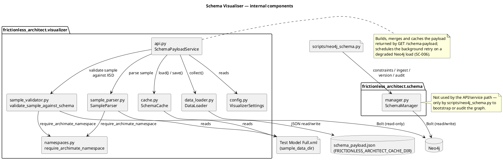
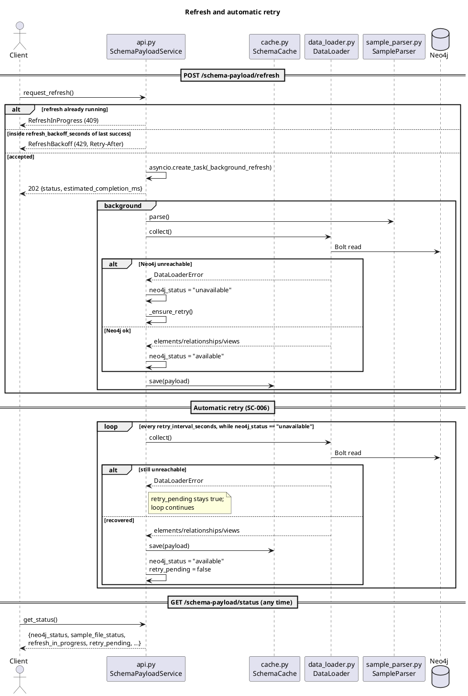

# Implementation Plan: Neo4j Schema Visualiser

**Branch**: `002-neo4j-schema-ui` | **Date**: 2026-04-04 | **Spec**: `/specs/002-neo4j-schema-ui/spec.md`
**Input**: Feature specification from `/specs/002-neo4j-schema-ui/spec.md`

## Summary
Deliver a single-user Neo4j schema visualiser that pairs every ArchiMate node/relationship/view definition with carefullly curated sample data (`sample-data/sample-00/Test Model Full.xml`), exposes the schema/diagram payload via FastAPI endpoints (the UI that consumes it moved to `schema-visualizer-ui`, #55), and keeps the schema summary accessible whenever sample data or Neo4j access is unavailable.

## Technical Context

**Language/Version**: Python 3.12 (per `pyproject.toml`).  
**Primary Dependencies**: FastAPI 0.128.x, uvicorn, neo4j 5.x driver, python-dotenv/pydantic for settings and payload validation, httpx/pytest for endpoint tests, ruff/pyright/mypy for linting.  
**Storage**: Neo4j 5 cluster for live schema metadata; canonical ArchiMate schema files under `sample-data/schema` and the enriched `sample-data/sample-00/Test Model Full.xml` drive the payloads. The visualiser caches aggregated JSON payloads in `.cache/visualiser` for offline resilience.  
**Testing**: Async `pytest` suites (`tests/api/…`), contract tests for `/schema-payload*` endpoints, including the 2-second target (SC-005), the load retry (SC-006) and duplicate-identifier warnings.  
**Target Platform**: Single-user desktop MVP that runs via `uvicorn frictionless_architect.app:app` (FastAPI) and exposes the `/schema-payload*` JSON API to any HTTP client on Windows/macOS/Linux; the service mounts no static assets or templates.  
**Project Type**: Single Python backend service with a file-cached payload; the UI is a separate package (#55).  
**Performance Goals**: Fetch/render schema payload <2 seconds, keep schema endpoints available at ≥99.5% uptime, surface `latency_ms` metrics along with warnings when caches or data reloads slow down.  
**Constraints**: Reads Neo4j only through one configured read-only service credential, no extra auth (ADR-0024), keep schemas visible even when `Test Model Full.xml` is missing, and optimize for laptop memory/CPU budgets.  
**Scale/Scope**: One analyst, fixed sample data (~dozens of elements/relations/diagram nodes), no multi-tenant or heavy throughput requirements.

### Research Context
- Visualization: dropped from this spec; `schema-visualizer-ui` (#55, ADR-0005/0020) draws the diagram and table from this payload. The service itself is JSON-only today — it mounts no `StaticFiles` and renders no templates. The unused `visualizer/static/` and `visualizer/templates/` files are leftover from before the UI split; whether they are deleted now or kept as a starting point for #55 is an open product decision (tracked separately, not resolved by this plan).  
- Types: sourced from the `architecture/model/` type system (`pyArchimate.ArchiType` plus the relationship matrix, ADR-0008) per FR-001; T020 moves the code over.  
- Sample parsing: `defusedxml`-wrapped `ElementTree` normalizes `sample-data/schema/*` + `Test Model Full.xml` into JSON that highlights coverage gaps and positions (FR-003); `xmlschema` validates the sample against the XSDs via `archimate3_Diagram.xsd`, reporting violations as non-blocking warnings (see [ADR-0022](../../docs/adr/0022-schema-visualiser-lxml-xmlschema.md)).  
- Access model: single read-only service credential (ADR-0024); cache the aggregated payload, show the warning “Sample data unavailable” when reloads fail, retry a failed load in the background (SC-006) and keep the schema view accessible.

## Constitution Check
*GATE: Must pass before Phase 0 research and again after Phase 1 design.*  
1. **Principle VII – System Integrity & Accuracy**: Schema payloads derive directly from ArchiMate definitions + curated sample (`Test Model Full.xml`); every displayed entity tracks its source file & identifiers, and coverage gaps are surfaced via warnings so data accuracy is guaranteed.  
2. **Principle VIII – Durability & Interoperability**: Cached JSON payloads plus documented sample-version lineage let downstream tooling (diagram/table, exports) keep working when Neo4j or sample files change, and the warning banner + retries preserve semantics.  
3. **Principle IX – Cross-Platform Consistency**: The same payload feeds every consumer (diagram and table in #55), with consistent warnings when data becomes stale or missing.

## Project Structure

### Documentation (this feature)

```text
specs/002-neo4j-schema-ui/
├── plan.md
├── research.md
├── data-model.md
├── quickstart.md
└── contracts/
```

### Source Code (repository root)

```text
src/frictionless_architect/
├── config.py
├── schema/             # existing Neo4j ingestion
└── visualizer/          # new FastAPI router + static assets + helpers
sample-data/
├── schema/              # ArchiMate XSD files
└── sample-00/           # Test Model.xml and richer Test Model Full.xml
tests/
└── api/                 # new endpoint coverage
```  

**Structure Decision**: Keep the single Python project layout and add `visualizer` plus the enriched sample data so the feature stays colocated with the Neo4j helpers.

## Design views

No component- or sequence-level diagram previously documented the visualiser's
internals (`SchemaPayloadService`, `SampleParser`, `DataLoader`, `SchemaCache`,
the XSD validator, and how `SchemaManager` relates to all of it). These two
close that gap; both are hand-authored PlantUML (not a projection of the
ArchiMate model — this is Python module structure, not an architecture-model
concept) and validated with the local `plantuml` binary (`-checkonly
-failfast2`, exit 0).

How the pieces fit together — note that `SchemaManager` (`schema/manager.py`)
is reachable only from `scripts/neo4j_schema.py`, never from the API path:



How a refresh request and the automatic retry (SC-006) interact with the
sources, in sequence:



## Complexity Tracking
No constitution violations detected; table omitted.
