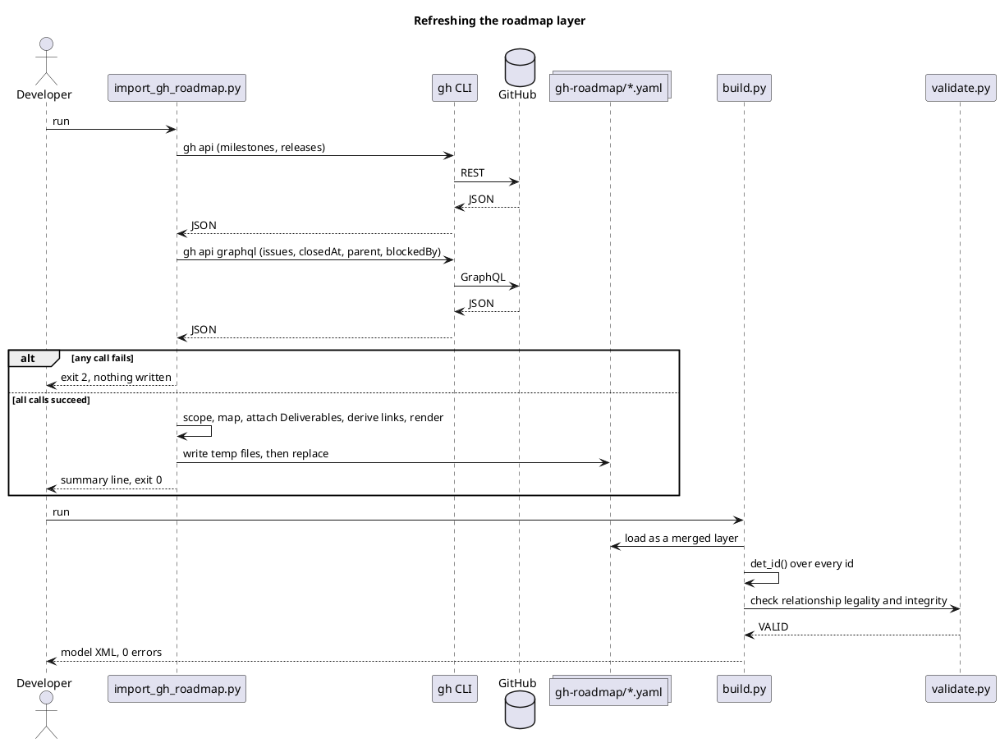

# Contract: importer CLI

```bash
poetry run python architecture/model/import_gh_roadmap.py [--repo OWNER/NAME] [--check]
poetry run python architecture/model/build.py   # then merges the layer
```

| Option | Meaning |
|---|---|
| `--repo OWNER/NAME` | Repository to read. Default: the one `gh repo view` resolves for the cwd. |
| `--check` | Fetch and render, write nothing; exit 1 if the on-disk layer differs from what a run would write. For CI or a pre-merge gate. |

## Behaviour

- Reads GitHub only through `gh` (argv list, no shell). Needs no new credential.
- Renders all three files in memory, then replaces them atomically. It never writes a partial layer.
- Prints one summary line, e.g. `wrote gh-roadmap: 2 milestones, 0 releases, 1 unreleased deliverable, 3 work packages, 0 triggering`, and `unchanged` when the bytes already match.

## Run sequence



## Exit codes

| Code | Meaning |
|---|---|
| 0 | Layer written, or already up to date; with `--check`, layer is current |
| 1 | `--check` only: layer is stale |
| 2 | `gh` missing, not authenticated, rate-limited or errored, or its output was unparseable. Stderr names the failing call and the fix. **No file touched.** (Same code `build.py` uses for input errors.) |

## Contract with `build.py`

`build.py` loads `gh-roadmap/{elements,relationships,views}.yaml` as an optional
layer: a missing directory is skipped silently, and a present-but-malformed file is a
normal `build.py` error. Nothing in `build.py` depends on the importer having run.
