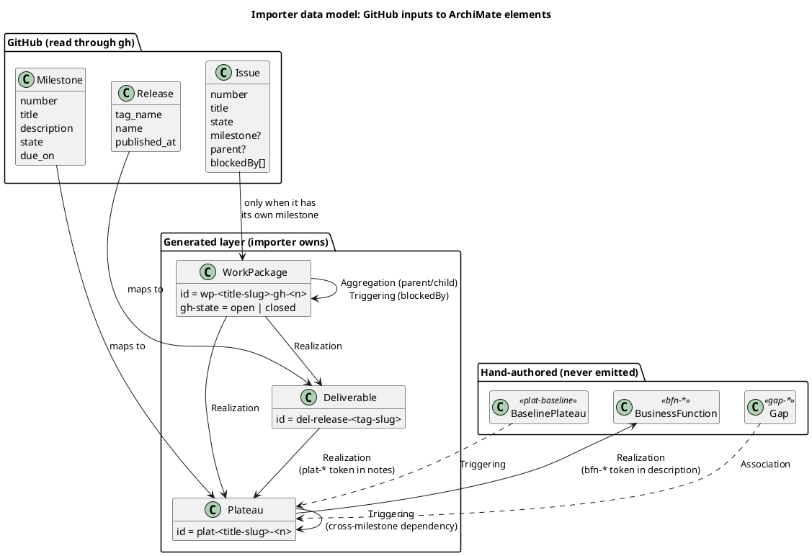
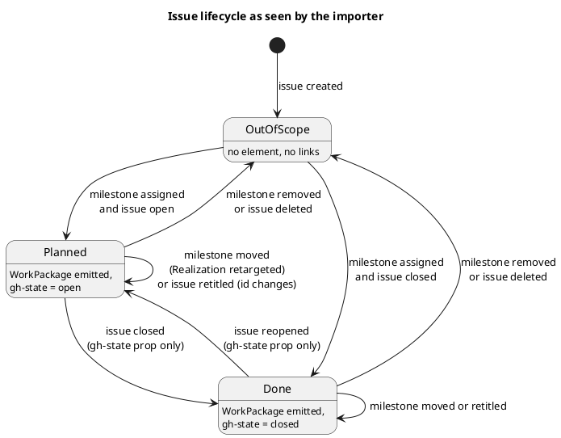

# Data Model: GitHub Roadmap Layer

Two sides: the GitHub inputs the importer reads, and the ArchiMate elements and
relationships it emits. All emitted YAML uses the existing schema
(`type` / `id` / `name` / `desc?` / `props?`; relationships `type` / `source` /
`target` / `label?`).

Only **Implementation & Migration** elements are emitted (Plateau, WorkPackage). Strategy
(Capability, CourseOfAction), Gaps and the baseline Plateau stay hand-authored in the
first-party model.

## Overview

How the GitHub inputs map to emitted and hand-authored ArchiMate elements.

## Inputs (read from GitHub)

| Input | Fields used |
|---|---|
| Milestone | `number`, `title`, `description`, `state`, `due_on`, `html_url` |
| Release | `tag_name`, `name`, `published_at`, `html_url` (drafts skipped) |
| Issue | `number`, `title`, `state`, `url`, `milestone.number`, `parent.number`, `blockedBy.nodes[].number` |

## Scope

An issue is **in scope** only when it carries a milestone itself. No inheritance from a
parent or descendants: the author controls granularity by choosing which issues get a
milestone. Everything else is dropped.

## Element ids

Element ids are prefixed by ArchiMate object type, never by source system.

| Source | `type` | `id` | `name` | `props` |
|---|---|---|---|---|
| Milestone | Plateau | `plat-<title-slug>-<n>` | milestone `title` | `gh-number`, `gh-url`, `gh-state`, `gh-due` (if set) |
| Release | Deliverable | `del-release-<tag-slug>` | release `name` or `tag_name` | `gh-tag`, `gh-url`, `gh-published` |
| In-scope issue | WorkPackage | `wp-<title-slug>-gh-<n>` | `#<n> <title>` | `gh-number`, `gh-url`, `gh-state` |

`gh-*` appears only as a **prop key** (provenance), never as an element id. A Plateau id
is the lower-cased, hyphenated milestone title plus its number, e.g. milestone 1
`policy-to-oscal-mvp` gives `plat-policy-to-oscal-mvp-1`. The number keeps it unique and
anchors identity; the slug keeps it readable. Renaming the milestone changes the slug, so
hand-authored references fail the build with an unknown id and are fixed in the same
commit. A Work Package id is `wp-<title-slug>-gh-<issue#>`: the issue title lower-cased, hyphenated and cut at a word boundary to at most 40 characters, then `-gh-` and the issue number. The number guarantees uniqueness, so truncation never collides. As with milestones, retitling an issue changes its id and breaks hand-authored references until they are updated. `desc` carries the milestone `description` for Plateaus; issue bodies are
never imported. A Work Package may be open (planned) or closed (done); `gh-state` records
which.

## Ownership split

| Owner | Elements |
|---|---|
| Importer | milestone Plateaus, release Deliverables, Work Packages, their Realization/Aggregation/Triggering links, the Plateau→BusinessFunction link |
| Hand-authored | baseline Plateau (`plat-baseline`), Gaps (`gap-<from>-to-<to>`), Strategy elements, links from Plateaus to technology/capabilities |

Hand-authored relationships and views may reference importer ids. If GitHub deletes the
object, the build fails with an unknown id, which is the intended signal.

## Emitted relationships

| Condition | Relationship |
|---|---|
| Work Package → its own milestone | `Realization` `wp-<slug>-gh-N → plat-<slug>-M` (omitted when the Work Package already realizes a release Deliverable that realizes the same Plateau) |
| Work Package → release Deliverable of its milestone | `Realization` `wp-<slug>-gh-N → del-release-<tag>` |
| Release notes name a `plat-*` id | `Realization` `del-release-<tag> → plat-*` |
| Parent and child both imported | `Aggregation` `wp-<slug>-gh-P → wp-<slug>-gh-C` |
| Work Package B blocked by Work Package A | `Triggering` `wp-<slug>-gh-A → wp-<slug>-gh-B` |
| A and B in different milestones N, M | one `Triggering` `plat-<slug>-N → plat-<slug>-M` (de-duplicated, no self-loops) |
| Milestone description names an existing `bfn-*` id | `Realization` `plat-<slug>-M → bfn-…` |

Derivation rule: a link is skipped when a chain already implies it, for example a
parent's direct Realization of a Plateau when an imported child already realizes the same
Plateau.

Dropped: any link with an out-of-scope end. A milestone not in the fetched set drops its
issues (guards a race between the two fetches).

## Gaps and ordering

A Gap is the difference between two Plateaus, so it is an architectural judgement and is
hand-authored: `Association` from each Plateau to the Gap (the only legal type). The
first MVP comes from `plat-baseline`, which represents the start state before any
milestone. Ordering between Plateaus comes from hand-authored `Triggering` between them
(including to a milestone with no issues yet) plus dependency-derived Triggering.

## Issue lifecycle (Principle VI)

State is derived each run from GitHub, not stored.

| GitHub change | Next import |
|---|---|
| Open ⇄ closed | Same id, type and links; `gh-state` prop changes |
| Milestone A → B | Same id; Realization retargets to B |
| Milestone removed from the issue | Element and links removed |
| Parent set or cleared | Aggregation added or removed |
| Issue or milestone deleted | Removed (current-state ledger, not history) |
| Blocked-by link added or removed | Triggering added or removed |

Lifecycle as the importer sees one issue:

## Invariants (asserted by tests)

1. Every emitted id is unique and begins with `plat-` or `wp-`; none begins with `gh-`.
2. Every relationship endpoint resolves to an emitted element or an existing
   first-party element (`bfn-*`).
3. No emitted element comes from an issue without its own milestone.
4. Same input gives byte-identical files.
5. Every emitted relationship is legal under the ArchiMate 3.2 matrix (`validate.py` exits 0).
6. Closing or reopening an issue changes only its `gh-state` prop.
