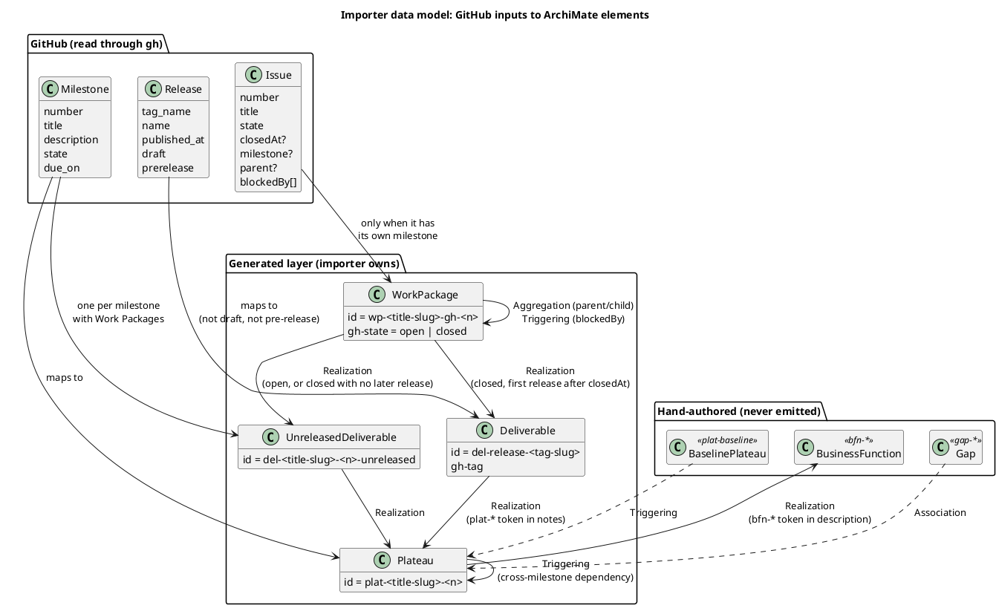
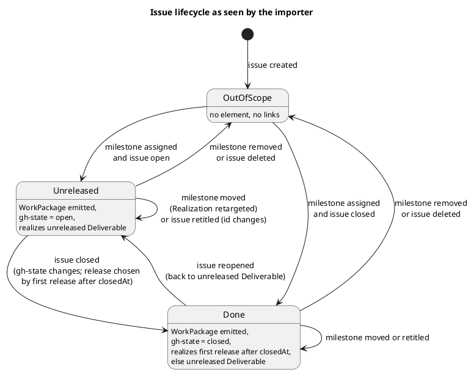

# Data Model: GitHub Roadmap Layer

Two sides: the GitHub inputs the importer reads, and the ArchiMate elements and
relationships it emits. All emitted YAML uses the existing schema
(`type` / `id` / `name` / `desc?` / `props?`; relationships `type` / `source` /
`target` / `label?`).

Only **Implementation & Migration** elements are emitted (Plateau, Deliverable, WorkPackage). Strategy
(Capability, CourseOfAction), Gaps and the baseline Plateau stay hand-authored in the
first-party model.

## Overview

How the GitHub inputs map to emitted and hand-authored ArchiMate elements.

## Inputs (read from GitHub)

| Input | Fields used |
|---|---|
| Milestone | `number`, `title`, `description`, `state`, `due_on`, `html_url` |
| Release | `tag_name`, `name`, `body` (notes), `published_at`, `draft`, `prerelease`, `html_url` |
| Issue | `number`, `title`, `state`, `closedAt`, `url`, `milestone.number`, `parent.number`, `blockedBy.nodes[].number` |

## Scope

An issue is **in scope** only when it carries a milestone itself. No inheritance from a
parent or descendants: the author controls granularity by choosing which issues get a
milestone. Everything else is dropped.

A release is **in scope** only when it is published: drafts and pre-releases are skipped
and attach no Work Package.

## Element ids

Element ids are prefixed by ArchiMate object type, never by source system.

| Source | `type` | `id` | `name` | `props` |
|---|---|---|---|---|
| Milestone | Plateau | `plat-<title-slug>-<n>` | milestone `title` | `gh-number`, `gh-url`, `gh-state`, `gh-due` (if set) |
| Release | Deliverable | `del-release-<tag-slug>` | release `name` or `tag_name` | `gh-tag`, `gh-url`, `gh-published` |
| Milestone with at least one Work Package | Deliverable (unreleased) | `del-<title-slug>-<n>-unreleased` | `<milestone title> (unreleased)` | `gh-number` |
| In-scope issue | WorkPackage | `wp-<title-slug>-gh-<n>` | `GH-<n> <title>` | `gh-number`, `gh-url`, `gh-state` |

`gh-*` appears only as a **prop key** (provenance), never as an element id. A Plateau id
is the lower-cased, hyphenated milestone title plus its number, e.g. milestone 1
`policy-to-oscal-mvp` gives `plat-policy-to-oscal-mvp-1`. The number keeps it unique and
anchors identity; the slug keeps it readable. Renaming the milestone changes the slug, so
hand-authored references fail the build with an unknown id and are fixed in the same
commit. A Work Package id is `wp-<title-slug>-gh-<issue#>`: the issue title lower-cased, hyphenated and cut at a word boundary to at most 40 characters (a single word longer than 40 is cut at 40), then `-gh-` and the issue number. The number guarantees uniqueness, so truncation never collides. As with milestones, retitling an issue changes its id and breaks hand-authored references until they are updated. `desc` carries the milestone `description` for Plateaus; issue bodies are
never imported. A Work Package may be open or closed (done); `gh-state` records
which.

## Untrusted text and id tokens

Release notes, milestone descriptions and titles come from GitHub and are untrusted.

- A `bfn-*` token in a milestone description, or a `plat-*` token in release notes, is
  honoured only when it **exactly matches** an existing element of the required type (a
  business function, or an imported Plateau, respectively). Anything else is ignored for
  relationships; the Plateau or Deliverable is still emitted.
- No GitHub text changes which elements or relationships are emitted beyond the rules in this
  document. Titles and descriptions are escaped before being written to YAML so the file
  always parses.

## Which Deliverable a Work Package realizes

A Work Package realizes exactly one Deliverable and never a Plateau directly.

1. Open Work Package: the unreleased Deliverable of its milestone.
2. Closed Work Package: among the release Deliverables that realize its milestone's Plateau
   (named by a `plat-*` token in the notes), the **first published after the issue's
   `closedAt`**. If there is none, the unreleased Deliverable.
3. Releases are ordered by `published_at`; ties break on `tag_name`, so output is deterministic.

A closed issue therefore moves to a later release once one is published after it, and a reopened
issue moves back to the unreleased Deliverable. The unreleased Deliverable is emitted only when at
least one Work Package realizes it, and a milestone with no Work Packages gets none.

## Ownership split

| Owner | Elements |
|---|---|
| Importer | milestone Plateaus, release and unreleased Deliverables, Work Packages, their Realization/Aggregation/Triggering links, the Plateau→BusinessFunction link |
| Hand-authored | baseline Plateau (`plat-baseline`), Gaps (`gap-<from>-to-<to>`), Strategy elements, links from Plateaus to technology/capabilities |

Hand-authored relationships and views may reference importer ids. If GitHub deletes the
object, the build fails with an unknown id, which is the intended signal.

## Emitted relationships

| Condition | Relationship |
|---|---|
| Open Work Package, or closed with no qualifying release | `Realization` `wp-<slug>-gh-N → del-<slug>-M-unreleased` |
| Closed Work Package with a qualifying release | `Realization` `wp-<slug>-gh-N → del-release-<tag>` (see "Which Deliverable a Work Package realizes") |
| Milestone has at least one Work Package | `Realization` `del-<slug>-M-unreleased → plat-<slug>-M` |
| Release notes name an imported `plat-*` id | `Realization` `del-release-<tag> → plat-*` |
| Parent and child both imported | `Aggregation` `wp-<slug>-gh-P → wp-<slug>-gh-C` |
| Work Package B blocked by Work Package A | `Triggering` `wp-<slug>-gh-A → wp-<slug>-gh-B` |
| A and B in different milestones N, M | one `Triggering` `plat-<slug>-N → plat-<slug>-M` (de-duplicated, no self-loops) |
| Milestone description names an existing `bfn-*` id | `Realization` `plat-<slug>-M → bfn-…` |

Derivation rule: a link is skipped when a chain already implies it, judged only against the links
the importer emits, never hand-authored ones, so output stays a function of GitHub state. A duplicate
against a hand-authored link is caught by `check_derived.py` over the layer's ids; remove the
hand-authored link. There is no Work Package → Plateau link at all: the Plateau is reached through a
Deliverable.

Dropped: any link with an out-of-scope end. A milestone not in the fetched set drops its
issues (guards a race between the two fetches).

## Gaps and ordering

A Gap is the difference between two Plateaus, so it is an architectural judgement and is
hand-authored: `Association` from each Plateau to the Gap (the only legal type). The
first MVP comes from `plat-baseline`, which represents the start state before any
milestone. Ordering between Plateaus comes from hand-authored `Triggering` between them
(including to a milestone with no issues yet) plus dependency-derived Triggering.

## Issue lifecycle (Principle VI)

State is derived each run from GitHub, not stored.

| GitHub change | Next import |
|---|---|
| Open ⇄ closed | Same id; `gh-state` changes, and the Deliverable realized may change (unreleased ⇄ release) |
| Release published after a closed issue | The issue's Realization moves from the unreleased Deliverable to that release |
| Milestone A → B | Same id; Realization retargets to a Deliverable of B |
| Milestone removed from the issue | Element and links removed |
| Parent set or cleared | Aggregation added or removed |
| Issue or milestone deleted | Removed (current-state ledger, not history) |
| Blocked-by link added or removed | Triggering added or removed |

Lifecycle as the importer sees one issue:

## Invariants (asserted by tests)

1. Every emitted id is unique and begins with `plat-`, `del-` or `wp-`; none begins with `gh-`.
2. Every relationship endpoint resolves to an emitted element or an existing
   first-party element (`bfn-*`).
3. No emitted element comes from an issue without its own milestone.
4. Same input gives byte-identical files.
5. Every emitted relationship is legal under the ArchiMate 3.2 matrix (`validate.py` exits 0).
6. Closing or reopening an issue changes its `gh-state` prop and, only where a qualifying release
   exists, the one Deliverable it realizes.
7. No Work Package realizes a Plateau directly; each realizes exactly one Deliverable.
8. Drafts and pre-releases never produce a Deliverable.
9. A `bfn-*` or `plat-*` token that does not exactly match an existing element of the right type
   creates no relationship.
10. An unreleased Deliverable exists only for a milestone with at least one Work Package.
