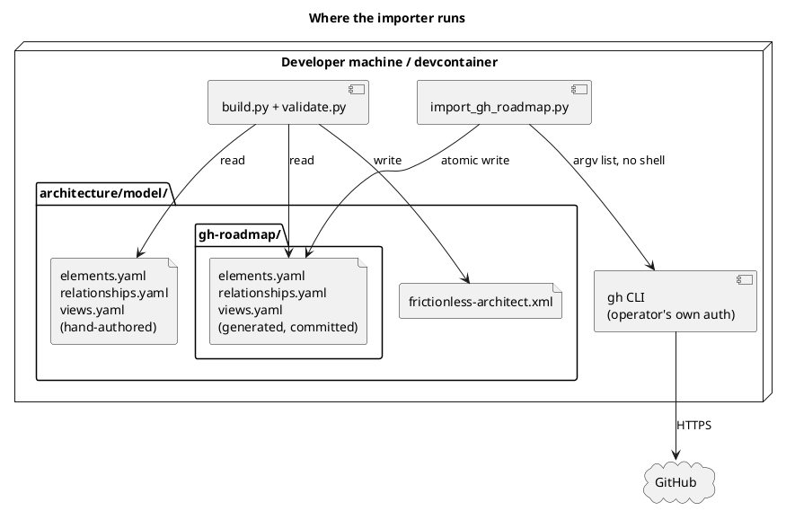
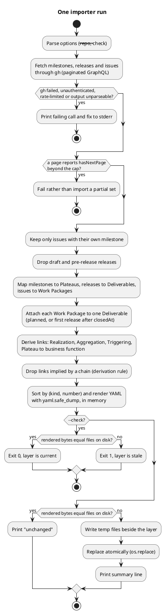

# Implementation Plan: GitHub Roadmap as ArchiMate Implementation & Migration

**Branch**: `feature/gh-95-roadmap-archimate` (issue #95) | **Date**: 2026-10-04 | **Spec**: [spec.md](spec.md)

**Input**: Feature specification from `specs/003-gh-roadmap-archimate/spec.md`

## Summary

`architecture/model/import_gh_roadmap.py` reads milestones, releases and issues through the
`gh` CLI and writes a generated, committed YAML layer under `architecture/model/gh-roadmap/`.
`build.py` merges it through the existing `det_id()`/`NS` pass (ADR-0029). The importer emits
only Plateaus, Deliverables and Work Packages; Gaps, the baseline Plateau and Strategy stay
hand-authored. Mapping, ids, relationships and the Deliverable rule are in
[data-model.md](data-model.md); decisions in [research.md](research.md). Output is
deterministic and written atomically only after every fetch succeeds. The mapping is filed
as ADR-0035.

## Technical Context

**Language/Version**: Python 3.12 (floor `>=3.11,<3.14`), same as `build.py`

**Primary Dependencies**: stdlib (`subprocess`, `json`, `pathlib`, `argparse`) + `pyyaml` (already imported by `build.py`); `gh` CLI (authenticated) as the only GitHub client — no new dependency

**Storage**: Files — generated YAML in `architecture/model/gh-roadmap/`, committed like `frictionless-architect.xml`

**Testing**: `pytest` — unit tests with a stubbed `gh` runner (recorded JSON fixtures); one integration test that runs `build.py` over a fixture layer and asserts the validator passes; behave scenario for the idempotency and single-change stories (SC-002/003)

**Target Platform**: Developer machine / devcontainer (Linux, WSL2), on demand

**Project Type**: Single script + generated data layer inside the architecture-model toolchain (not an application package)

**Performance Goals**: One import under ~30 s for this repo (≈50 issues); not on any hot path (Principle IV N/A)

**Constraints**: Idempotent byte-identical output (FR-007); fail clearly and write nothing on any `gh` failure (FR-009); every emitted relationship legal in the ArchiMate 3.2 matrix (FR-004); YAML built by `yaml.safe_dump`, never string-templated (FR-006, hostile titles)

**Scale/Scope**: 2 milestones (`policy-to-oscal-mvp` #1, `multi-user-collaboration` #2, no issues yet), 0 releases, 3 in-scope issues today (#44, #61, #7); hundreds supported; design holds to hundreds of issues

## Constitution Check

*GATE: passed before Phase 0; re-checked after Phase 1 — still passes.*

| Principle | Assessment |
|---|---|
| I. Code Quality | Small pure functions (fetch → map → render → write); mapping is a pure function over plain dicts, trivially testable. Pass. |
| II. Testing | TDD order in tasks: stub-`gh` unit tests first, then idempotency/single-change tests, then `build.py` integration. 90% gate applies to the new module if `architecture/model/` is in coverage scope — T034 adds `architecture/model` to the pre-merge coverage run. Pass. |
| III. UX Consistency | CLI mirrors `build.py` (`poetry run python architecture/model/import_gh_roadmap.py`); errors name the failing `gh` call and the fix (`gh auth login`). Pass. |
| IV. Performance | Off hot path; no 200 ms obligation. Pass. |
| V. Security | Uses the operator's existing `gh` auth; no tokens read, stored or logged; issue/milestone text is untrusted input and is only ever passed through `safe_dump`. `gh` invoked with an argv list, never `shell=True`. Pass. |
| VI. State Mgmt | Issue lifecycle (open ⇄ closed, release published after close, milestone moved/removed) is a documented state table in `data-model.md`. Pass. |
| VII. Integrity | Whole model re-validated by `validate.py` after merge; importer output is a pure function of GitHub state. Pass. |
| VIII. Durability | Output schema is the existing YAML schema (ADR-0007/0008); stable ids never renumbered. Pass. |
| IX. Cross-Platform | Pure Python + `gh`; no OS-specific paths. Pass. |
| X. Decision Traceability | ADR-0035 filed in the same PR; `architecture/model/README.md` and `ARCHITECTURE.md` §8 updated; model impact stated below. Pass (tracked in tasks). |
| XI. Concise Artefacts | Detail lives in `data-model.md`; other artefacts link to it. Pass. |

No violations; Complexity Tracking is empty.

### Model impact

- Adds the generated layer `architecture/model/gh-roadmap/` (`plat-*`, `del-*`, `wp-*`, their relationships and one view per milestone).
- Retires `plat-runtime-mvp` and `plat-runtime-target`, replaced by the generated `plat-policy-to-oscal-mvp-1` and `plat-multi-user-collaboration-2` (milestone #2, now created); every relationship and view member that named them is retargeted.
- Renames `gap-runtime-hosted` to `gap-policy-to-oscal-mvp-to-multi-user-collaboration` and adds `gap-baseline-to-policy-to-oscal-mvp`, with their Associations and the Triggering between the Plateaus.
- Changes `build.py` (`MODEL_LAYERS`) and `architecture/model/README.md`; regenerate diagrams after `validate.py`.

## Project Structure

### Documentation (this feature)

```text
specs/003-gh-roadmap-archimate/
├── plan.md              # This file
├── research.md          # Phase 0
├── data-model.md        # Phase 1
├── quickstart.md        # Phase 1
├── contracts/
│   ├── importer-cli.md      # command, exit codes, failure behaviour
│   └── gh-roadmap-layer.md  # shape of the generated YAML layer
├── checklists/requirements.md
└── tasks.md             # Phase 2 — /speckit-tasks (not created here)
```

### Source Code (repository root)

```text
architecture/model/
├── import_gh_roadmap.py      # NEW: gh → mapping → YAML layer
├── build.py                  # CHANGED: load gh-roadmap/ as a merged layer (see research R3)
├── gh-roadmap/               # NEW, generated + committed, never hand-edited
│   ├── elements.yaml
│   ├── relationships.yaml
│   └── views.yaml
└── README.md                 # CHANGED: document the layer + importer

docs/adr/0035-github-roadmap-as-implementation-migration-layer.md   # NEW
docs/adr/README.md                                                  # CHANGED: index row

tests/unit/architecture/test_import_gh_roadmap.py     # NEW
tests/unit/architecture/test_build_layers.py          # NEW
tests/unit/architecture/fixtures/gh_*.json            # NEW: recorded gh payloads
tests/features/gh_roadmap_import.feature (+ steps)    # NEW: SC-002/SC-003
```

**Structure Decision**: Single script beside `build.py`, as the issue and ADR-0007
direct; it is model tooling, not an extracted platform package, so `platform/` is
not used. Tests mirror the existing `tests/unit/<area>/` layout.

## Design views

Where the importer runs:



What one run does, and when it writes nothing:



## Complexity Tracking

No constitution violations to justify.
