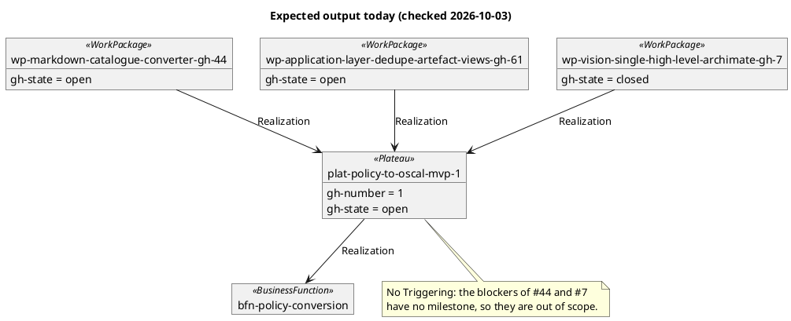

# Quickstart: validate the roadmap import end to end

Prerequisites: `poetry install`, and `gh auth status` showing a logged-in account with
read access to the repo. Contracts: [importer CLI](contracts/importer-cli.md),
[layer shape](contracts/gh-roadmap-layer.md). Model: [data-model.md](data-model.md).

## 1. Import and build

```bash
poetry run python architecture/model/import_gh_roadmap.py
poetry run python architecture/model/build.py
```

Expect: a summary line, then `build.py` reporting a model that validates. On this repo
today (checked 2026-10-03):

- 1 Plateau `plat-policy-to-oscal-mvp-1` (`policy-to-oscal-mvp`), 0 releases, realizing `bfn-policy-conversion`.
- 3 WorkPackages: `wp-markdown-catalogue-converter-gh-44`, `wp-application-layer-dedupe-artefact-views-gh-61`, `wp-vision-single-high-level-archimate-gh-7`, each realizing the Plateau.
  #7 is closed; the others are open.
- No Triggering: #44's blockers (#43, #45, #47–#49) and #7's blocker (#5) have no
  milestone, so they are out of scope.
- The other issues are absent, including #47–#49, #76, #83 and its children.
- No `gap-*`, `plat-baseline` or Strategy element: those are hand-authored.



The counts will drift as the repo does; re-derive with `gh` before treating them as fixed.

## 2. Idempotency (SC-002, US5.1)

```bash
poetry run python architecture/model/import_gh_roadmap.py
git status --short architecture/model/gh-roadmap/   # expect: no output
```

## 3. Single change (SC-003, US5.2)

Close one in-scope issue and assign one out-of-scope issue to the milestone on GitHub,
then re-import. The closed issue should change only its `gh-state` prop. The new issue
should add its element and relationships (and a `views.yaml` member). Nothing else changes.

## 4. Failure leaves the layer untouched (FR-014)

```bash
GH_TOKEN=invalid poetry run python architecture/model/import_gh_roadmap.py; echo $?
git status --short architecture/model/gh-roadmap/   # expect: no output
```

Expect exit `2`, a message naming the failing `gh` call, and no file change.

## 5. Diagrams (FR-012, SC-004)

```bash
poetry run python architecture/model/render_diagrams.py
```

Expect `diagrams/migration/overview.*` to list the imported Plateau and WorkPackages
alongside the hand-authored Gaps, and a `diagrams/migration/plat-policy-to-oscal-mvp-1.*` roadmap
view for the milestone.

## 6. Gates

```bash
poetry run pytest tests/unit/architecture
bash scripts/pre_commit_checks.sh
```
