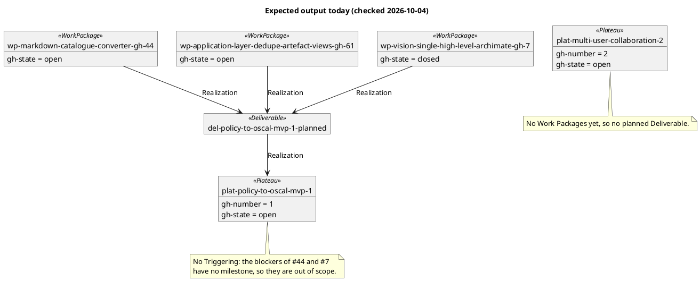

# Quickstart: validate the roadmap import end to end

Prerequisites: `poetry install`, and `gh auth status` showing a logged-in account with
read access to the repo. Contracts: [importer CLI](contracts/importer-cli.md),
[layer shape](contracts/gh-roadmap-layer.md). Model: [data-model.md](data-model.md).

## 1. Import and build

```bash
poetry run python architecture/model/import_gh_roadmap.py
poetry run python architecture/model/build.py
```

Expect: a summary line, then `build.py` reporting a model that validates. On this repo
today (checked 2026-10-04):

2 Plateaus (`policy-to-oscal-mvp`, `multi-user-collaboration`), 1 planned Deliverable and 3 Work
Packages (#44, #61, #7), each realizing the planned Deliverable, plus the two published releases
(`v0.1.0`, `v0.1.1`; their notes name no Plateau, so neither is attached). No Triggering, Gap or
`plat-baseline` is generated (the blockers have no milestone).
Rules: [data-model.md](data-model.md).



The counts will drift as the repo does; re-derive with `gh` before treating them as fixed.

## 2. Idempotency (SC-002, US3)

```bash
poetry run python architecture/model/import_gh_roadmap.py
git status --short architecture/model/gh-roadmap/   # expect: no output
```

## 3. Single change (SC-003, US3)

Close one in-scope issue and assign one out-of-scope issue to the milestone on GitHub,
then re-import. The closed issue should change only its `gh-state` prop (and, if a release
published after its close names the Plateau, the one Deliverable it realizes). The new issue
should add its element and relationship (and a `views.yaml` member). Nothing else changes.

## 3b. Release attachment (FR-003)

With a published, non-pre-release release whose notes contain `plat-policy-to-oscal-mvp-1`,
a Work Package closed before that release was published realizes `del-release-<tag>`; open ones stay on the planned
Deliverable. A draft or pre-release changes nothing.

## 4. Failure leaves the layer untouched (FR-009)

```bash
GH_TOKEN=invalid poetry run python architecture/model/import_gh_roadmap.py; echo $?
git status --short architecture/model/gh-roadmap/   # expect: no output
```

Expect exit `2`, a message naming the failing `gh` call, and no file change.

## 5. Diagrams (FR-010, SC-004)

```bash
poetry run python architecture/model/render_diagrams.py
```

Expect `diagrams/migration/overview.*` to list the imported Plateaus, Deliverables and Work
Packages alongside the hand-authored Gaps, and one `diagrams/migration/plat-<slug>-<n>.*`
roadmap view per milestone.

## 6. Gates

```bash
poetry run pytest tests/unit/architecture
bash scripts/pre_commit_checks.sh
```
