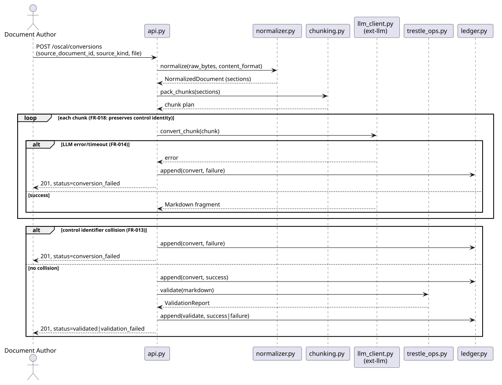
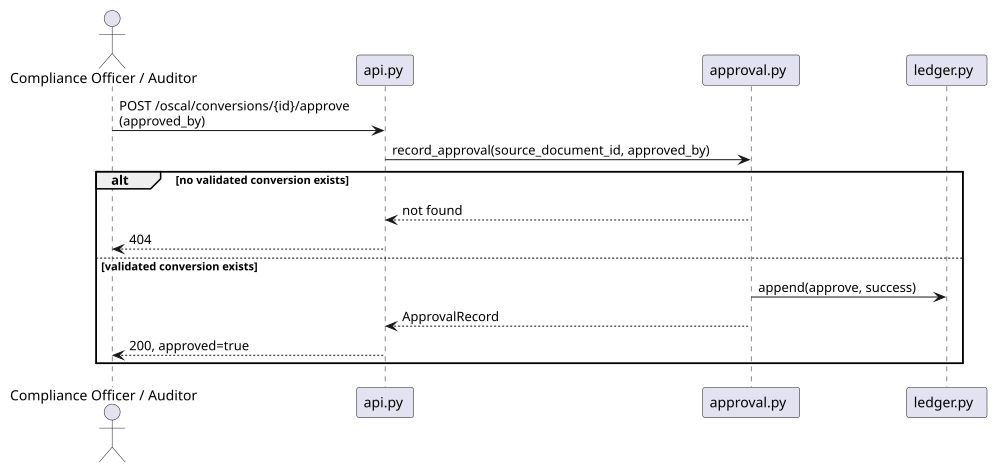
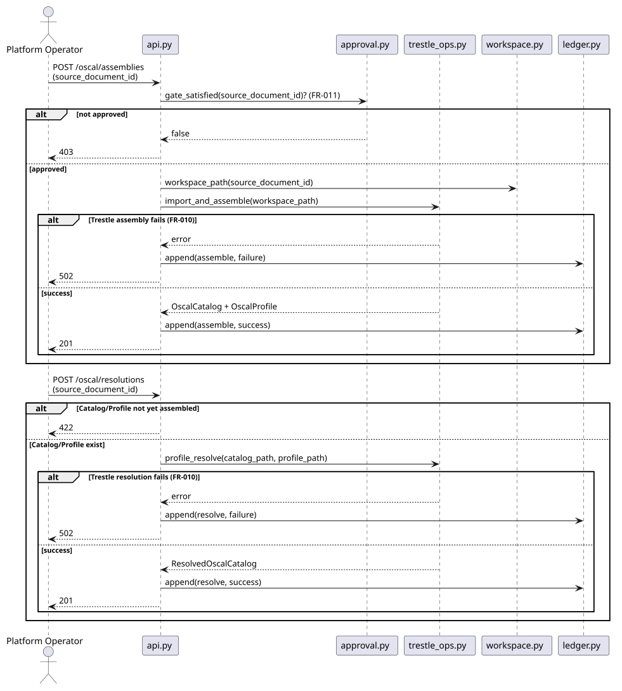

# API Contracts: AI-Assisted Policy & Standard Conversion to OSCAL

All endpoints are mounted under `/oscal` in the existing FastAPI app, following
`TECHNICAL.md`'s API Design Principles (resource-based URLs, action-based endpoints for
FSM-like transitions, Pydantic v2 request/response validation, standardized error body).
This is the primary "customer journey" surface — later role-specific UIs (Document
Author upload flow, Compliance Officer review queue) call these endpoints; none are
built as part of this feature.

Standard error body (all endpoints): `{ "error_code": str, "message": str, "details": {} }`.

## POST /oscal/conversions

- **Purpose**: Submit a verbatim document for normalization + AI-assisted conversion to
  Trestle-editable Markdown (US1, FR-001–FR-003, FR-013, FR-014, FR-018).
- **Body** (`multipart/form-data`):
  - `source_document_id` (string, required) — stable identifier (FR-015).
  - `source_kind` (`"custom-policy" | "regulatory-standard"`, required) — drives FR-011.
  - `file` (binary, required) — one of PDF / `.docx` / `.xlsx` / `.csv` / `.md` / `.txt`.
- **Response (201)**:
  ```json
  {
    "source_document_id": "org-remote-access-policy-v3",
    "status": "validated",
    "source_map": [
      {
        "source_id": "SRC-001",
        "heading": "3.2 Remote Access Authentication",
        "level": 2,
        "start_line": 44,
        "end_line": 61,
        "text_sha256": "…",
        "oscal_target": "org-ac-17",
        "status": "converted",
        "notes": null
      }
    ],
    "validation_report": { "target": "…", "status": "pass", "validators": ["trestle.core.validator"], "errors": [], "generated_at": "2026-09-24T00:00:00Z", "note": "Structural validation only; not an audit opinion." },
    "workspace_path": ".data/oscal/workspaces/org-remote-access-policy-v3"
  }
  ```
  - `status: "conversion_failed"` when FR-013 (identifier collision) or FR-014 (LLM
    error/timeout) fires — no Markdown is persisted; `validation_report` is `null` and the
    failure reason is carried in the ledger entry's `detail`.
  - `status: "validation_failed"` when conversion produced Markdown but it fails Trestle's
    structural/header checks (FR-003) — `validation_report.status == "fail"` with
    `validation_report.errors` listing the specifics.
  - A `source_map` entry with `status: "unconvertible"` flags a section not confidently
    mapped to a control (US1 Acceptance Scenario 3); overall `status` stays `"validated"`
    if the rest passed. Field shapes: `data-model.md` `SourceMapEntry`/`ValidationReport`.
- **Errors**:
  - `409` — resubmission is **not** an error (FR-015 overwrites); `409` is reserved for a
    conversion already in progress for the same `source_document_id`.
  - `422` — unsupported `content_format` / malformed request.
- **Side effects**: appends a `convert` (and, if run, `validate`) `LedgerEntry`.

## GET /oscal/conversions/{source_document_id}

- **Purpose**: Retrieve the latest conversion result/status for an identifier (supports
  polling from a future review UI).
- **Response (200)**: same shape as the POST response above.
- **Errors**: `404` — no conversion has ever been submitted under this identifier.

## POST /oscal/conversions/{source_document_id}/approve

- **Purpose**: Compliance Officer / Auditor approval gate before assembly (FR-011).
- **Body**: `{ "approved_by": "jsmith" }`
- **Response (200)**:
  ```json
  { "source_document_id": "org-remote-access-policy-v3", "approved": true, "approved_by": "jsmith", "approved_at": "2026-09-23T10:00:00Z" }
  ```
- **Errors**: `404` — no `validated` conversion exists for this identifier yet (nothing to
  approve).
- **Side effects**: appends an `approve` `LedgerEntry`.

## POST /oscal/assemblies

- **Purpose**: Orchestrate Trestle import + author/assemble into an OSCAL Catalog and
  Profile from a validated, approved conversion (US2, FR-004, FR-009, FR-010, FR-011).
- **Body**: `{ "source_document_id": "org-remote-access-policy-v3" }`
- **Response (201)**:
  ```json
  {
    "source_document_id": "org-remote-access-policy-v3",
    "catalog_path": ".data/oscal/workspaces/org-remote-access-policy-v3/dist/catalogs/catalog.json",
    "profile_path": ".data/oscal/workspaces/org-remote-access-policy-v3/dist/profiles/profile.json",
    "assembled_at": "2026-09-23T10:05:00Z"
  }
  ```
- **Errors**:
  - `403` — FR-011 gate not satisfied (not approved, or a `regulatory-standard` document
    requiring per-conversion re-approval).
  - `422` — the referenced conversion isn't in `status: "validated"`.
  - `502` — Trestle assembly failed against otherwise-validated Markdown (FR-010) — body
    carries Trestle's specific failure, never a partial Catalog/Profile.
- **Side effects**: appends an `assemble` `LedgerEntry`.

## POST /oscal/resolutions

- **Purpose**: Orchestrate Trestle profile-resolve into a fully resolved OSCAL Catalog
  (US3, FR-005, FR-009, FR-010).
- **Body**: `{ "source_document_id": "org-remote-access-policy-v3" }`
- **Response (201)**:
  ```json
  {
    "source_document_id": "org-remote-access-policy-v3",
    "resolved_catalog_path": ".data/oscal/workspaces/org-remote-access-policy-v3/dist/resolved/catalog.json",
    "resolved_at": "2026-09-23T10:07:00Z"
  }
  ```
- **Errors**:
  - `422` — the referenced Catalog/Profile pair doesn't exist yet (US3 Acceptance
    Scenario 2 — "Profile references a Catalog that hasn't been assembled").
  - `502` — Trestle resolution failed (FR-010).
- **Side effects**: appends a `resolve` `LedgerEntry`.

## Sequence diagrams

Internal module collaboration behind each endpoint — module names match
`plan.md`'s Project Structure / Component diagram.

### Sequence: submitting a conversion

Source: `../diagrams/oscal-conversions-sequence.puml`.



### Sequence: approving a conversion

Source: `../diagrams/oscal-approve-sequence.puml`.



### Sequence: assembling and resolving

Source: `../diagrams/oscal-assemble-resolve-sequence.puml`.



## Out of scope for this contract

- No endpoint exposes or queries the forensic ledger directly — it's an internal audit
  artefact (FR-017), not a feature of this API surface.
- No endpoint runs the golden-dataset validation (FR-006/FR-007) — that's a test-only
  path (`research.md` R8), not a production API capability.
