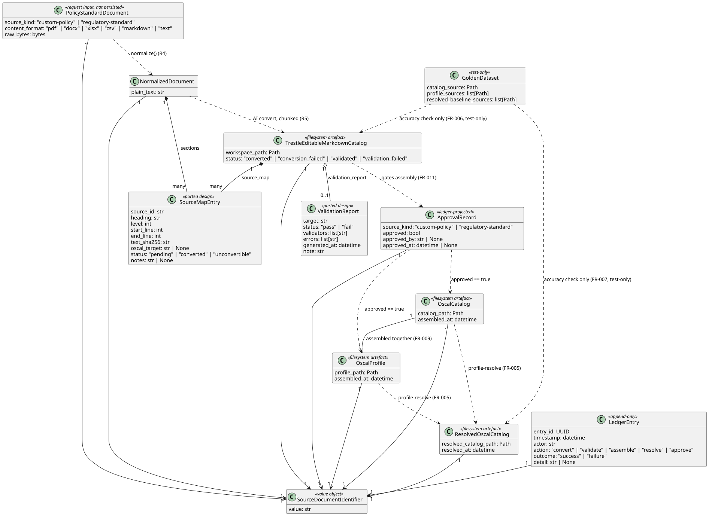
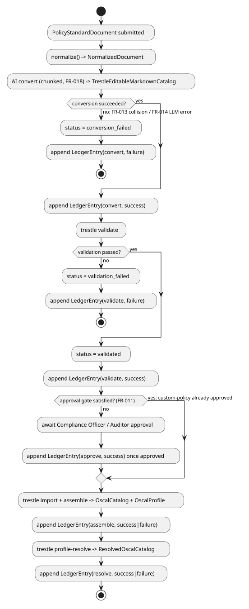
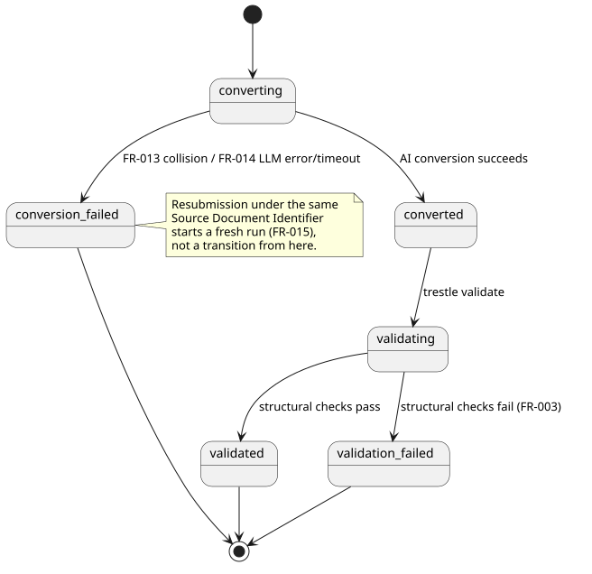
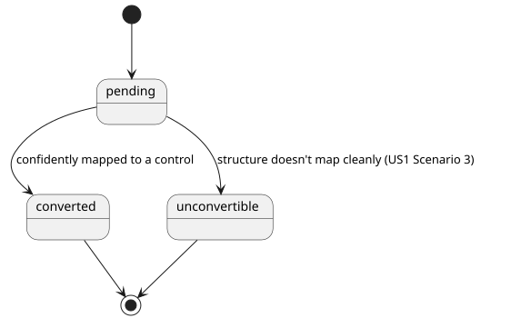
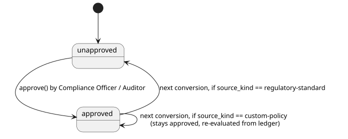

# Phase 1 Data Model: AI-Assisted Policy & Standard Conversion to OSCAL

Entities below map directly to the spec's "Key Entities" section. All are first-party
Pydantic v2 models (`frictionless_architect.oscal.models`) unless noted as a filesystem
artefact.

## SourceDocumentIdentifier

- `value: str` — author-provided stable identifier (title/policy ID). Used verbatim as the
  Trestle workspace slug key (R7); normalized (lowercase, non-alphanumerics → `-`) only for
  the filesystem path, never for display or ledger records.
- Identity, not a record: this is the partition key threaded through every other entity
  below.

## PolicyStandardDocument (request-time input, not persisted as a domain object)

- `source_document_id: SourceDocumentIdentifier`
- `source_kind: Literal["custom-policy", "regulatory-standard"]` — drives FR-011's review
  rule.
- `content_format: Literal["pdf", "docx", "xlsx", "csv", "markdown", "text"]`
- `raw_bytes: bytes` (request payload; not stored beyond the normalization step)

## NormalizedDocument

- `source_document_id: SourceDocumentIdentifier`
- `plain_text: str` — output of `normalizer.normalize()` (R4).
- `sections: list[SourceMapEntry]` — heading-based sections (ported design, R4/R10); also
  the chunk boundaries R5's conversion step packs into LLM calls.

## SourceMapEntry (ported design — `oscal-document-workbench`'s `source-map.csv`, R4/R10)

- `source_id: str` — stable within one document, e.g. `SRC-001`, `SRC-002`, ... .
- `heading: str`
- `level: int` — Markdown heading depth (1–6).
- `start_line: int` / `end_line: int` — within the normalized plain text.
- `text_sha256: str`
- `oscal_target: str | None` — the control identifier this section was mapped to, once
  conversion assigns one; `None` while `status == "pending"`.
- `status: Literal["pending", "converted", "unconvertible"]`
- `notes: str | None` — why a section is `"unconvertible"` (US1 Acceptance Scenario 3).

## TrestleEditableMarkdownCatalog (filesystem artefact + status record)

- `source_document_id: SourceDocumentIdentifier`
- `workspace_path: Path` — `<data_dir>/workspaces/<slug>/` (R7).
- `status: Literal["converted", "conversion_failed", "validated", "validation_failed"]`
- `source_map: list[SourceMapEntry]` — carried through from `NormalizedDocument.sections`,
  updated in place as conversion resolves each section to a control (or marks it
  `unconvertible`). Any entry with `status == "unconvertible"` is surfaced to the author
  for review even when the overall conversion otherwise succeeds — never silently dropped.
- `validation_report: ValidationReport | None` — from Trestle's own structural/header
  validation (FR-003); `None` until validation has run.

## ValidationReport (ported design — `oscal-document-workbench`'s validation report, R6/R10)

- `target: str` — path validated (a Trestle-editable Markdown tree, or a produced OSCAL
  file).
- `status: Literal["pass", "fail"]` — this feature never needs `"partial"` (the original
  script's `partial` meant "some external validator CLI wasn't installed"; here the one
  validator is always the in-process trestle Python API, so it's binary).
- `validators: list[str]` — which check(s) ran (e.g. `"trestle.core.validator"`).
- `errors: list[str]` — empty when `status == "pass"`.
- `generated_at: datetime`
- `note: str` — carried verbatim from the ported design: `"Structural validation only;
  not an audit opinion."` (matches FR-010/SC-004's "specific, actionable error, never an
  implied compliance verdict").

## ApprovalRecord

- `source_document_id: SourceDocumentIdentifier`
- `source_kind: Literal["custom-policy", "regulatory-standard"]`
- `approved: bool`
- `approved_by: str | None` — actor identity (Compliance Officer / Auditor); `None` until
  approved.
- `approved_at: datetime | None`
- Derived/read-projected from the ledger (R9), not an independently-written store.
- **Transition rule (FR-011)**: `regulatory-standard` documents always re-require
  approval; `custom-policy` documents stay approved across later re-conversions of the
  same identifier once `approved: true`, re-evaluated from the ledger on every assembly.

## OscalCatalog / OscalProfile (filesystem artefacts)

- `source_document_id: SourceDocumentIdentifier`
- `catalog_path: Path`
- `profile_path: Path`
- `assembled_at: datetime`
- Produced only from an `ApprovalRecord` with `approved: true` (FR-011) and a
  `TrestleEditableMarkdownCatalog` with `status == "validated"` (FR-003/FR-004).
- Never substitutes for one another or for the resolved catalog (FR-009) — kept as
  distinct paths/records, never merged into one "OSCAL output" blob.

## ResolvedOscalCatalog (filesystem artefact)

- `source_document_id: SourceDocumentIdentifier` (of the Profile's owning conversion)
- `resolved_catalog_path: Path`
- `resolved_at: datetime`
- Produced from an existing `OscalCatalog` + `OscalProfile` pair (FR-005); fails clearly
  (no artefact written) if the referenced Catalog hasn't been assembled yet (US3 Acceptance
  Scenario 2).

## GoldenDataset (test-only, not a runtime domain entity)

- `catalog_source: Path` — vendored `third_party/oscal-content` NIST SP 800-53 rev5
  catalog + verbatim standard text used as conversion input (R8).
- `profile_sources: list[Path]` — vendored LOW/MODERATE/HIGH/PRIVACY profiles.
- `resolved_baseline_sources: list[Path]` — vendored FedRAMP pre-resolved baselines
  (`third_party/fedramp-automation`).
- Read-only fixtures; a golden-dataset run never writes back into `third_party/`.

## LedgerEntry (append-only filesystem artefact — the ledger itself)

- `entry_id: UUID`
- `timestamp: datetime` (UTC)
- `actor: str` — who/what performed the action (author identity, or `"system"` for
  automated steps).
- `action: Literal["convert", "validate", "assemble", "resolve", "approve"]`
- `source_document_id: SourceDocumentIdentifier`
- `outcome: Literal["success", "failure"]`
- `detail: str | None` — short human-readable context (error message on failure, artefact
  path on success).
- One JSON object per line in `<data_dir>/forensic-ledger.jsonl` (R3); never rewritten or
  deleted — corrections are new entries, not mutations.

## Class diagram

Source: `diagrams/oscal-class-diagram.puml`.

## Pipeline activity diagram

Supersedes the previous informal text description — still not a formal FSM
per Constitution VI (see `plan.md` Constitution Check); this shows data
transformations, not a governed-lifecycle entity's own action-based
endpoints.

Source: `diagrams/oscal-pipeline-activity.puml`.

## State machines

### `TrestleEditableMarkdownCatalog.status`

Source: `diagrams/oscal-catalog-status.puml`.

### `SourceMapEntry.status`

Source: `diagrams/oscal-sourcemap-status.puml`.

### `ApprovalRecord.approved` (FR-011)

Source: `diagrams/oscal-approval-status.puml`.

