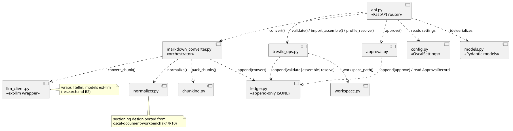

# Implementation Plan: AI-Assisted Policy & Standard Conversion to OSCAL

**Branch**: `003-oscal-ai-conversion` | **Date**: 2026-09-23 | **Spec**: [spec.md](spec.md)

**Input**: Feature specification from `/specs/003-oscal-ai-conversion/spec.md`

## Summary

Build the first real path from a verbatim policy/regulatory-standard document (PDF,
Word, spreadsheet/CSV, Markdown, or text) to machine-readable OSCAL, orchestrated end to
end behind a new FastAPI surface (`/oscal/*`, mounted alongside the existing
schema-visualiser app): normalize → AI-assisted, chunked conversion to Trestle-editable
Markdown → Trestle structural validation → a Compliance-Officer approval gate → Trestle
import/assemble into an OSCAL Catalog + Profile → Trestle profile-resolve into a fully
resolved Catalog. Because neither an LLM client nor a forensic audit ledger exists in
code yet (both are architecture-model vision only — `ext-llm`, `store-ledger`), this
feature also stands up minimal, tightly-scoped first-party versions of each: a
`litellm`-backed conversion client and an append-only JSONL ledger, built only to the
shape this feature needs. Accuracy is proven against two vendored golden datasets (NIST
SP 800-53 rev5 via `third_party/oscal-content`, FedRAMP baselines via
`third_party/fedramp-automation`) in a separate, marked test path — never as a production
input source (FR-008).

Normalization's sectioning/traceability design and the validation-report shape are
ported as native Python from `oscal-document-workbench` (Apache-2.0 prior art for an
adjacent SSP-drafting problem, not a dependency of this feature — `research.md` R10).

## Technical Context

**Language/Version**: Python 3.12 (repo range `>=3.11,<3.14` per `pyproject.toml`).

**Primary Dependencies**: FastAPI (existing app, new `/oscal` router), Pydantic v2,
`compliance-trestle` (existing dependency, used via its Python command classes —
research.md R6), `litellm` (new — `ext-llm` client, R2), `pypdf` (new — PDF
normalization), `python-docx` (new — Word normalization), `openpyxl` (new — `.xlsx`
normalization; stdlib `csv` covers `.csv`).

**Storage**: Filesystem only — Trestle workspaces per Source Document Identifier under
`.data/oscal/workspaces/<slug>/` (R7), and an append-only JSONL forensic ledger at
`.data/oscal/forensic-ledger.jsonl` (R3). No Postgres/Neo4j dependency for this feature.

**Testing**: `pytest` + `pytest-asyncio` (existing app pattern, `tests/api/` in-process
`httpx.AsyncClient` against the FastAPI app) for the fast suite; a separate `golden`
pytest marker for the FR-006/FR-007 golden-dataset validation that invokes a real LLM and
real trestle (excluded from the default run — R8). `tests/unit/oscal/` mirrors
`src/frictionless_architect/oscal/` per `TECHNICAL.md`'s Testing Layout. Real trestle
CLI/library invocations in tests, never mocked (FR-012, constitution-aligned since
mocking the one thing under integration test would hide the behavior we need to catch).

**Target Platform**: Linux server (same as the existing visualiser deployment target).

**Project Type**: Single project — extends the existing `src/frictionless_architect/`
package with a new `oscal/` subpackage, mounted into the existing FastAPI app instance
rather than a second service.

**Performance Goals**: No fixed request-latency target for conversion/assembly/resolution
(these are long-running, LLM-bound operations, not the <1s/<5s query targets in
`NONFUNCTIONALS.md`, which apply to read-path queries). `GET /oscal/conversions/{id}`
status reads should meet the NONFUNCTIONALS "common queries <1s" bar since they're a
plain filesystem/ledger read.

**Constraints**: Documents may exceed a single LLM context window and MUST still convert
correctly via chunking that preserves control identity (FR-018, R5). LLM failures/timeouts
must produce zero partial output (FR-014) — every write path is all-or-nothing per
identifier. Verbatim document content is sent to the LLM as-is, no redaction step
(FR-016) — this is a deliberate, spec-approved deviation from ADR-0014's PII-gateway rule,
scoped narrowly: see Constitution Check below.

**Scale/Scope**: Single-user, locally-run MVP scope per `ADR-0024`/`PROJECT_SPECIFICATION.md`
— one conversion/assembly/resolution in flight at a time per Source Document Identifier
(concurrent submissions to the *same* identifier are rejected `409`, not queued).

## Constitution Check

*GATE: Must pass before Phase 0 research. Re-checked after Phase 1 design below.*

| Principle | Assessment |
|---|---|
| I. Code Quality | New `oscal/` subpackage follows the existing `visualizer/` module boundaries (config/api/service-per-concern). No violation. |
| II. Testing Standards | Real trestle invocations in tests (FR-012) instead of mocks is the correct application of "verified correctness" here — mocking the one integration surface under test would hide real behavior. Golden-dataset tests are marked and excluded from the fast loop to keep TDD's red-green cycle fast for everything else; coverage target (>90%) applies to the fast suite. No violation. |
| III. UX Consistency | API follows the same action-based-endpoint / Pydantic-validation pattern as the existing visualiser contract (`specs/002-neo4j-schema-ui/contracts/api.md`). Error body is standardized (`error_code`/`message`/`details`) per `TECHNICAL.md`. No violation. |
| IV. Performance | Conversion/assembly/resolution are inherently >200ms (LLM + trestle round-trip) — handled as async/background-eligible operations, consistent with "any operation exceeding 200ms must be asynchronous or justified." Justified here: LLM latency is external and unavoidable. |
| V. Security | FR-016 sends verbatim document content to the LLM without ADR-0014's redaction step. Policy/standard documents are organizational artefacts inside the trust boundary, not collaboration-tool chatter carrying PII/PHI — a different ingestion path, not a bypass; ADR-0014 is unchanged. Recorded as `ADR-0031`. |
| VI. State Management | `ApprovalRecord`/conversion `status` are explicit, ledger-derived states with defined transitions (data-model.md "State machines"). No violation. |
| VII. System Integrity & Accuracy | Golden-dataset validation (FR-006/FR-007) validates the AI-assisted pipeline before it's trusted, against a "faithful paraphrase" bar (SC-002/SC-003). No violation. |
| VIII. Durability & Interoperability | Outputs are real OSCAL JSON validated against `third_party/oscal` schemas; Catalog/Profile/Resolved-Catalog stay distinct (FR-009). Ported designs (R10) carry Apache-2.0 attribution headers; the port decision itself is recorded in `ADR-0030`. No violation. |
| IX. Cross-Platform Consistency | Pure backend/API feature, no OS-specific or display-dependent behavior. Not applicable beyond "runs the same on any Linux host," which filesystem-only storage satisfies. |

**Gate result**: PASS, with one explicit, spec-directed exception (V. Security / FR-016)
recorded above rather than hidden — no Complexity Tracking entry needed since it is not
added complexity, it's a documented scope boundary the spec itself set via clarification.

**Tracked follow-ups**: filed as `ADR-0031` (FR-016's deviation from `ADR-0014`'s
redaction rule) and as an update to `ADR-0030` (the decision to port, not vendor or
depend on, `oscal-document-workbench`'s sectioning and validation-report designs).

## Project Structure

### Documentation (this feature)

```text
specs/003-oscal-ai-conversion/
├── plan.md              # This file
├── research.md          # Phase 0 output
├── data-model.md         # Phase 1 output
├── quickstart.md         # Phase 1 output
├── contracts/
│   └── api.md            # Phase 1 output
└── tasks.md              # Phase 2 output (/speckit-tasks — not created by this command)
```

### Source Code (repository root)

```text
src/frictionless_architect/
├── visualizer/                        # existing — unchanged by this feature
├── schema/                            # existing — unchanged by this feature
└── oscal/                             # NEW
    ├── __init__.py
    ├── api.py                         # FastAPI router: /oscal/conversions, /approve, /assemblies, /resolutions
    ├── config.py                      # OscalSettings (FRICTIONLESS_ARCHITECT_ env prefix, data_dir, llm model/timeout)
    ├── models.py                      # Pydantic request/response + domain models (data-model.md)
    ├── normalizer.py                  # PDF/Word/spreadsheet-CSV/Markdown/text -> NormalizedDocument + SourceMapEntry sections (R4; sectioning ported from oscal-document-workbench, R10 — attribution header)
    ├── chunking.py                    # packs normalizer sections into LLM-call chunks preserving control identity (R5)
    ├── llm_client.py                  # ext-llm wrapper over litellm (R2)
    ├── markdown_converter.py          # orchestrates normalize+chunk+LLM -> Trestle Markdown, updates SourceMapEntry.status per section
    ├── trestle_ops.py                 # import / author-assemble / profile-resolve via trestle's Python API (R6); validate produces a ValidationReport (shape ported from oscal-document-workbench, R10 — attribution header)
    ├── workspace.py                   # Trestle workspace layout keyed by Source Document Identifier (R7)
    ├── approval.py                    # FR-011 approval-gate logic, reads ApprovalRecord off the ledger
    └── ledger.py                      # append-only JSONL forensic ledger (R3)

tests/
├── unit/oscal/                        # mirrors src/frictionless_architect/oscal/, one test module per production module
├── api/
│   ├── test_oscal_conversions.py      # US1
│   ├── test_oscal_assemblies.py       # US2
│   ├── test_oscal_resolutions.py      # US3
│   └── test_oscal_golden_dataset.py   # FR-006/FR-007, marked `golden`, excluded from default run
└── features/                          # behave acceptance scenarios added via acceptance-author, per AGENTS.md workflow
```

### Component diagram

Module dependencies within `src/frictionless_architect/oscal/` (arrows read "depends
on" / "calls"). Source: `diagrams/oscal-component-diagram.puml`.



**Structure Decision**: Single project, extending the existing
`src/frictionless_architect/` package with one new sibling subpackage (`oscal/`) to
`visualizer/` and `schema/`, mounted into the same FastAPI app instance rather than a
second service — there is no `packages/` monorepo split yet (`ARCHITECTURE.md` §3 is a
target, not current state), so this follows the current flat layout. This slice maps to
`packages/policy-enforcement` in the target topology (`ARCHITECTURE.md` §4) and should
extract cleanly when that migration reaches it (`ARCHITECTURE.md` §8, step 7).

## Complexity Tracking

*No unjustified Constitution violations — see Constitution Check above (the one FR-016
security deviation is spec-directed and documented there, not a complexity trade-off).*

| Violation | Why Needed | Simpler Alternative Rejected Because |
|---|---|---|
| — | — | — |
