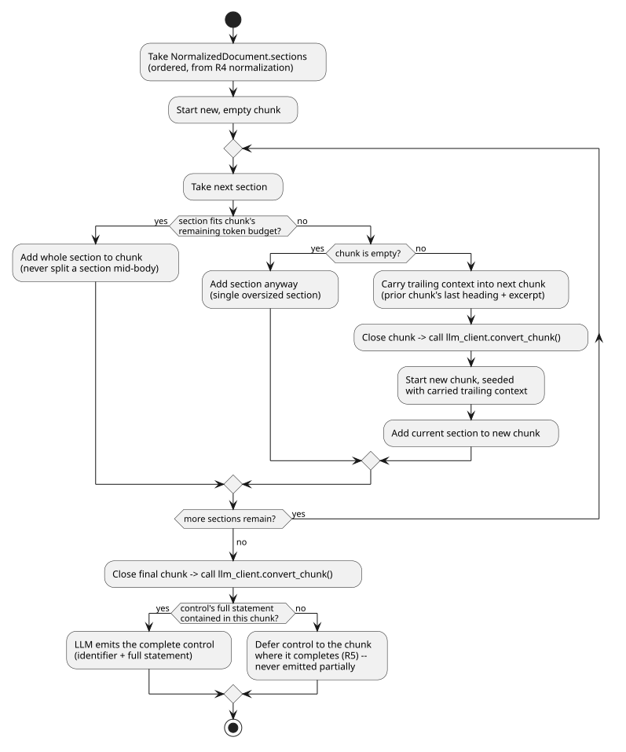

# Phase 0 Research: AI-Assisted Policy & Standard Conversion to OSCAL

## R1. Primary interface

- **Decision**: A FastAPI service (`frictionless_architect.oscal.api`), added as a new
  router alongside the existing visualiser app, exposing conversion/assembly/resolution/
  approval as resource-oriented endpoints. No CLI in this feature.
- **Rationale**: The API is the surface multiple future UIs (Document Author upload
  flow, Compliance Officer review queue, operator dashboard) will be built against.
  Matches `TECHNICAL.md` API Design Principles (RESTful,
  action-based endpoints for FSM-like resources) and the one implemented precedent in this
  repo (the schema-visualiser FastAPI app).
- **Alternatives considered**: CLI-only (rejected — no future UI could reuse it without a
  rewrite); CLI+API (rejected — doubles surface area/tests for a spec that names no CLI
  user).

## R2. `ext-llm` client

- **Decision**: A thin first-party wrapper, `frictionless_architect.oscal.llm_client`,
  backed by `litellm` (already named in `TECHNICAL.md` → Utilities for LLM). Scoped to
  exactly what this feature needs: one call shape (`convert_chunk(prompt, system) -> str`)
  with provider/model/timeout read from settings, and errors normalized to a single
  `LlmConversionError` so FR-014 ("fail the whole conversion, no partial output") has one
  exception type to catch.
- **Rationale**: `ext-llm` is modeled in `architecture/model/elements.yaml` (an
  `ApplicationComponent` in "External systems") but has no first-party code anywhere in
  `src/`. This feature is the first to actually call an LLM, so it must stand up the
  client — but only the slice it needs, not a general-purpose provider abstraction that
  belongs to a future governance-engine/security-foundations feature.
- **Alternatives considered**: Call an LLM SDK (e.g. `anthropic`) directly — rejected,
  `litellm` is the toolchain's named choice and keeps provider choice a config value, not
  a code change. Build a fuller provider-routing/retry framework — rejected as
  over-scoped; add only if a second feature needs it (YAGNI, `AGENTS.md` conventions).

## R3. Forensic ledger

- **Decision**: A minimal first-party ledger, `frictionless_architect.oscal.ledger`, that
  appends one JSON line per event to a local file
  (`<data_dir>/forensic-ledger.jsonl`, default `.data/oscal/`), matching the
  `art-ledger-entry` shape already defined in the architecture model (`actor`, `action`,
  `target`, `outcome`, `timestamp`). Append-only; no update/delete API.
- **Rationale**: Same gap as R2 — `store-ledger`/`fn-ledger-record` are modeled, not
  built. JSONL is the simplest thing that is genuinely append-only, queryable line-by-line,
  and needs no new infra (no Postgres/Neo4j dependency for this feature — `ADR-0018`
  Postgres integration is unbuilt). This is explicitly a narrow, first-party version
  scoped narrowly to this feature, not the platform-wide ledger service.
- **Alternatives considered**: SQLite — rejected for this iteration, adds a schema/
  migration surface for no benefit at current scale (single-user MVP, `ADR-0024`); a
  future feature can migrate the ledger to Postgres/Neo4j without changing this feature's
  `LedgerEntry` contract. In-memory/log-only — rejected, fails FR-017's durability
  expectation (a restarted process must not lose entries).

## R4. Document normalization (PDF / Word / spreadsheet/CSV / Markdown / plain text)

- **Decision**: Format-specific extractors behind one `normalize(path, content_type) ->
  NormalizedDocument` entry point in `frictionless_architect.oscal.normalizer`:
  - PDF → `pypdf` (pure-Python, no system dependency like poppler).
  - Word (`.docx`) → `python-docx`.
  - Spreadsheet/CSV → stdlib `csv` for `.csv`; `openpyxl` for `.xlsx`.
  - Markdown / plain text → read as UTF-8 text directly (no library).
  All paths converge on plain text, split into headed **sections**: `source_id`
  (`SRC-001`, `SRC-002`, ...), `heading`, `level`, `start_line`/`end_line`, a `sha256` of
  the section body, and a short `excerpt` — the `SourceMapEntry` shape in
  `data-model.md`. One section per sheet or logical row-group for spreadsheet/CSV inputs.
  Sectioning design and attribution requirement: R10.
- **Rationale**: Each format library is small and single-purpose; avoids a heavyweight
  all-in-one document-conversion dependency (e.g. `unstructured`). Section-level
  addressing directly supports FR-003's requirement to surface unconvertible parts.
- **Alternatives considered**: `unstructured` library — rejected, heavy dependency tree
  for five well-known formats. Shelling out to external scripts/CLI tools
  (`pandoc`/`pdftotext`/`pymupdf`) — rejected: this feature's stack is in-process Python
  (R6). Legacy `.doc`/`.xls` — out of scope per spec.

## R5. Chunking strategy for documents larger than one LLM context window (FR-018)

- **Decision**: Reuse the sections produced by normalization (R4) directly as chunk
  boundaries — one or more whole sections per LLM call, packed up to a configured token
  budget, never splitting a section mid-body. A small trailing-context overlap (the
  previous chunk's last section heading + its `excerpt`) is carried into the next chunk's
  prompt so a control whose statement spans two sections still resolves to one identifier
  and one coherent statement. The LLM is prompted per chunk to emit complete controls
  only — a control not fully contained in the current chunk's visible sections is
  deferred to the chunk where it completes, not partially emitted.
- **Rationale**: Matches the spec's own requirement ("preserves control identity... across
  chunk boundaries") better than fixed-size token windows, which routinely split a
  control statement mid-sentence — and by building directly on R4's ported section
  boundaries, chunking and normalization share one structural model instead of each
  re-deriving "where does a section start/end" independently.
- **Alternatives considered**: Fixed-token sliding window with overlap — rejected, no
  guarantee a control's full statement lands inside one window; naive per-page chunking
  (PDF) — rejected, page breaks don't align with control boundaries.

Source: `diagrams/oscal-chunking-activity.puml`.

## R6. Trestle orchestration surface

- **Decision**: Orchestrate via `trestle`'s Python API where importable
  (`trestle.core.commands.*` command classes, invoked in-process) rather than shelling out
  to the `trestle` CLI as a subprocess, wrapped in
  `frictionless_architect.oscal.trestle_ops`. Each of import / author markdown assemble /
  profile-resolve gets one function with a narrow, typed return (paths + success/failure),
  and FR-012 is satisfied because these are real trestle invocations, not mocks.
- **Rationale**: In-process avoids subprocess/PATH/venv-isolation fragility in tests and
  CI, and `compliance-trestle` is already a library dependency (not just a CLI), so its
  command classes are directly importable. Errors from trestle are caught and normalized
  into this feature's own error types so FR-010's "clear, actionable error" requirement
  doesn't leak raw trestle stack traces.
- **Alternatives considered**: Subprocess `trestle` CLI calls — rejected as the primary
  path (harder to test deterministically, slower, and CI must still resolve the `trestle`
  entry point); may still be used as a fallback per command if a given trestle version's
  Python API proves unstable, tracked as an implementation-time finding, not a plan
  decision.

- **Validation report shape**: `{ target, status, validators, errors, generated_at,
  note }`, produced by wrapping the in-process trestle validate call above. Matches
  FR-010/SC-004 (a specific, actionable error, never an implied compliance verdict). See
  `ValidationReport` in `data-model.md`; design provenance and attribution: R10.

## R7. Trestle workspace layout keyed by Source Document Identifier

- **Decision**: One Trestle workspace subdirectory per Source Document Identifier under
  `<data_dir>/workspaces/<slug(source_document_id)>/`, following Trestle's own expected
  `catalogs/`, `profiles/`, `dist/` layout. Resubmission under the same identifier (FR-015)
  reuses and overwrites that same workspace rather than creating a new one.
- **Rationale**: Directly satisfies FR-015 (overwrite-on-resubmission) with the identifier
  as the natural partition key, and keeps each conversion's intermediate/authored/assembled
  artefacts co-located for debugging and for the golden-dataset validation runs (FR-006/
  FR-007), which need their own separate workspace(s) seeded from vendored content, never
  the production identifier space (FR-008).
- **Alternatives considered**: One shared Trestle workspace for all documents — rejected,
  makes FR-013's collision detection and FR-015's overwrite scope ambiguous (which
  document does a shared catalog's colliding ID belong to?).

## R8. Golden-dataset validation (FR-006/FR-007, SC-002/SC-003)

- **Decision**: A dedicated, separate test workspace seeded from
  `third_party/oscal-content` (NIST SP 800-53 rev5 verbatim text extracted from the
  vendored catalog's own control statements, used as conversion *input*) and
  `third_party/fedramp-automation` (FedRAMP's pre-resolved baselines, used as resolution
  *expected output*), exercised by a `pytest` marker (e.g. `golden`) run separately from
  the fast unit suite because it invokes the real LLM and real trestle. "Correctly
  identified, faithfully worded" (SC-002/SC-003) is judged by an LLM-as-judge comparison
  step (paraphrase-equivalence, not exact string match), consistent with
  `NONFUNCTIONALS.md`'s allowance for AI-assisted evaluation of natural-language output.
- **Rationale**: Keeps the expensive, non-deterministic golden-dataset run out of the
  default fast test loop (`TECHNICAL.md` targets a few seconds for the API suite) while
  still making it a real, automated, repeatable check per FR-006/FR-007.
- **Alternatives considered**: Manual/ad-hoc golden-dataset spot checks — rejected, not
  reproducible and doesn't satisfy "MUST be validated" as an automated requirement.

## R9. FR-011 approval-gate state

- **Decision**: A durable `ApprovalRecord` keyed by Source Document Identifier
  (approved: bool, approved_by, approved_at, source_kind: custom|regulatory-standard),
  persisted alongside the ledger (or as ledger-derived state — the ledger is the source of
  truth; an `ApprovalRecord` is a small read-side projection over the latest "approval"
  ledger entry for that identifier). Assembly checks this record before running; regulatory-
  standard conversions always re-require approval regardless of the record.
- **Rationale**: FR-011's "first successful conversion... not previously approved" rule
  needs queryable state, and re-deriving it from the ledger (rather than a second
  independent store) keeps ledger and approval state from drifting apart.
- **Alternatives considered**: A separate approvals table independent of the ledger —
  rejected, risks the two going out of sync (constitution VII, "silent deviations").

## R10. Relationship to `oscal-document-workbench`

- **Decision**: `oscal-document-workbench` (`oscal-compass-lab/compliance-trestle-skills`,
  Apache-2.0) is not a runtime dependency and is not vendored under `third_party/`. It
  drafts an OSCAL **SSP** against an already-existing Catalog/Profile (its
  `fetch-oscal-baseline.sh` imports the real NIST/FedRAMP baseline), a different problem
  from this feature, which authors a **new** Catalog and Profile from verbatim text with
  no prior OSCAL representation (US1/US2, FR-001–FR-008). It is agent-only tooling (a
  Claude Code plugin of shell scripts for an interactive agent session), not an
  importable library a FastAPI handler can call synchronously.
- **Reused**: the logic of two scripts, ported to native Python and adapted to this
  feature's stack (in-process trestle Python API instead of CLI/`oscal-cli` subprocesses;
  Pydantic models instead of CSV/JSON files; extended to spreadsheet/CSV, which the
  original doesn't support):
  - `scripts/extract-legacy-doc.sh` → sectioning/traceability design (R4).
  - `scripts/validate-oscal-package.sh` → validation report shape (R6).
- **Rationale**: Reuses a proven section/traceability and validation-report design
  without taking on agent-only tooling or shell orchestration that doesn't fit this
  feature's synchronous API design (R1).
- **Licensing**: Apache-2.0, compatible with this repo's AGPL-3.0 (no copyleft conflict,
  per the same analysis as `ADR-0030`). Porting logic carries an attribution obligation
  under Apache-2.0 §4 ("state that You changed the files"): `normalizer.py` and the
  validation code in `trestle_ops.py` each carry a header comment naming the source
  project, its license, and that the approach is adapted, not copied verbatim.
- **Follow-up**: an ADR records this decision, parallel to `ADR-0030` (tracked in
  `plan.md`).
- **Alternatives considered**: vendor the scripts under `third_party/` and shell out to
  them — rejected, they assume an interactive agent session and CLI tools
  (`pandoc`/`pdftotext`/`oscal-cli`) that don't fit a synchronous in-process service, and
  `third_party/` is reserved for forks tracked long-term (`ADR-0002`). Model conversion
  itself as an agent-driven skill — rejected, conflicts with the API-as-primary-interface
  decision (R1).
