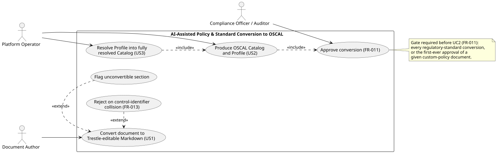
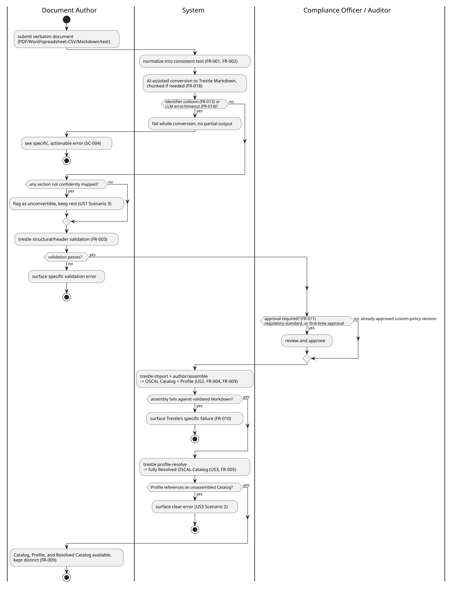

# Feature Specification: AI-Assisted Policy & Standard Conversion to OSCAL

**Feature Branch**: `003-oscal-ai-conversion`

**Created**: 2026-09-22

**Status**: Draft

**Input**: User description: "AI-assisted conversion of verbatim policy and regulatory-standard documents into OSCAL Catalogs and Profiles via compliance-trestle: AI-assisted Markdown conversion, Trestle round-trip assembly, and Trestle profile resolution. Downstream consumption of the outputs is out of scope. See User Scenarios, Requirements, and Assumptions below for the full, clarified scope."

## User Scenarios & Testing *(mandatory)*

### User Story 1 - Convert a verbatim document into Trestle-editable Markdown (Priority: P1)

A Standards or Document Author has a verbatim policy or regulatory-standard document (PDF, Word, spreadsheet/CSV, Markdown, or plain text -- e.g. a Word file containing an organization's own policy, or a spreadsheet export of a standard like NIST SP 800-53). They submit it to the system, which normalizes it into a consistent, readable text form and then uses an LLM to convert it into the Markdown control structure that compliance-trestle's authoring commands expect -- without the author needing to know Trestle's file conventions, hand-format any content, or convert the source format themselves.

**Why this priority**: This is the actual new capability being built. Nothing upstream of this exists today -- policy content currently has no automated path into machine-readable form at all. Every other part of this feature depends on this conversion succeeding first.

**Independent Test**: Can be fully tested by submitting a verbatim document and confirming the system produces Markdown that passes compliance-trestle's own structural/header validation, independent of whether assembly or resolution ever runs.

**Acceptance Scenarios**:

1. **Given** a verbatim custom policy document, **When** it is submitted for conversion, **Then** the system produces Trestle-editable Markdown control content structured to Trestle's authoring conventions.
2. **Given** a verbatim upstream regulatory-standard document (e.g. NIST SP 800-53 text), **When** it is submitted for conversion, **Then** the system produces Trestle-editable Markdown using the same conversion capability as for custom policy documents.
3. **Given** a verbatim document whose structure doesn't map cleanly to discrete controls, **When** conversion is attempted, **Then** the system surfaces which parts of the document it could not confidently convert, rather than silently guessing.
4. **Given** a verbatim document supplied as PDF, Word, spreadsheet/CSV, Markdown, or plain text, **When** it is submitted, **Then** the system normalizes it into a consistent text representation before AI-assisted Markdown conversion runs, regardless of source format.

---

### User Story 2 - Produce an OSCAL Catalog and Profile from converted Markdown (Priority: P2)

Once Markdown content exists (from User Story 1, or already present in a Trestle workspace), the platform operator obtains a validated, machine-readable OSCAL Catalog and OSCAL Profile without manually running compliance-trestle's CLI commands themselves.

**Why this priority**: This is thin orchestration around an existing, well-understood third-party tool (compliance-trestle) rather than new logic -- valuable, but lower-risk than User Story 1, and depends on it for its primary input path.

**Independent Test**: Can be fully tested by supplying already-valid Trestle Markdown (bypassing AI conversion) and confirming the system produces an OSCAL Catalog and Profile.

**Acceptance Scenarios**:

1. **Given** valid Trestle-editable Markdown, **When** the system assembles it, **Then** it produces a machine-readable OSCAL Catalog and OSCAL Profile.
2. **Given** Markdown that fails Trestle's own structural validation, **When** assembly is attempted, **Then** the system surfaces the specific validation failure rather than producing a partial or corrupt OSCAL file.

---

### User Story 3 - Resolve a Profile into a fully resolved Catalog (Priority: P3)

Given an OSCAL Catalog and an OSCAL Profile that tailors it, a user obtains a fully resolved OSCAL Catalog -- the flattened, catalog-shaped set of controls the Profile actually selects -- ready for consumption by downstream tooling without manually running the resolution step.

**Why this priority**: Also thin orchestration around an existing Trestle command, and is only needed once a Catalog and Profile already exist (User Story 2). Downstream consumers of the resolved catalog (pattern/blueprint traceability, control enforcement) are explicitly out of scope for this feature.

**Independent Test**: Can be fully tested by supplying an existing valid Catalog and Profile pair and confirming a resolved Catalog is produced, independent of where that Catalog/Profile pair came from.

**Acceptance Scenarios**:

1. **Given** a valid OSCAL Catalog and a Profile that tailors it, **When** resolution is run, **Then** the system produces a fully resolved OSCAL Catalog.
2. **Given** a Profile that references a Catalog that hasn't been assembled/imported yet, **When** resolution is attempted, **Then** the system surfaces a clear error rather than producing an incomplete resolved Catalog.

---

### Edge Cases

- Control-identifier collision with an existing catalog: fails the whole conversion (FR-013).
- LLM error/timeout mid-conversion, including mid-chunk on a large document: fails the whole conversion, no partial output (FR-014, FR-018).
- Resubmission of a document under the same Source Document Identifier: overwrites the prior output (FR-015).
- Upstream standard already has a well-known pre-built OSCAL catalog (e.g. NIST SP 800-53): production still converts from the verbatim text (FR-008).

## Use case diagram

Actors and capabilities from the User Stories above, plus the two edge-case extension
points (unconvertible section, control-identifier collision) and the FR-011 approval
gate that US2 includes.

Source: `diagrams/oscal-use-case-diagram.puml`.

## Journey activity diagram

End-to-end flow across the three user stories, by actor. Mirrors the Acceptance
Scenarios and Edge Cases above; see `data-model.md`'s pipeline activity diagram for
the equivalent entity/ledger view, and `contracts/api.md` for the endpoint each step
calls.

Source: `diagrams/oscal-journey-activity.puml`.

## Requirements *(mandatory)*

### Functional Requirements

- **FR-001**: System MUST accept a verbatim policy or regulatory-standard document as input in PDF, Word, spreadsheet/CSV, Markdown, or plain-text format, normalize it into a consistent text representation, and use an LLM to produce Trestle-editable Markdown control content structured to compliance-trestle's authoring conventions.
- **FR-002**: System MUST support both custom-authored organizational policy/standard documents and upstream regulatory-standard text (e.g. NIST SP 800-53) as inputs to the same conversion capability, with no separate workflow per source type or per input format.
- **FR-003**: System MUST validate AI-converted Markdown against compliance-trestle's own structural/header conventions before assembly, and surface actionable, specific errors when the conversion output doesn't conform.
- **FR-004**: System MUST orchestrate compliance-trestle's import and author/assemble commands to turn validated Trestle-editable Markdown into a machine-readable OSCAL Catalog and OSCAL Profile.
- **FR-005**: System MUST orchestrate compliance-trestle's profile-resolve command to produce a fully resolved OSCAL Catalog from an OSCAL Profile and its source Catalog.
- **FR-006**: System MUST be validated against a golden dataset: converting the verbatim NIST SP 800-53 rev5 standard text MUST be checked against the real, pre-built NIST SP 800-53 rev5 OSCAL catalog and LOW/MODERATE/HIGH/PRIVACY profiles (vendored reference content) to measure conversion accuracy.
- **FR-007**: System MUST be validated against a second golden dataset for the resolution step: resolving the golden profiles against the golden catalog MUST be checked against FedRAMP's pre-resolved LOW/MODERATE/HIGH baseline catalogs (vendored reference content).
- **FR-008**: System MUST NOT treat vendored golden-dataset content as a production input -- production conversions always originate from a verbatim document run through AI conversion, never from the vendored reference catalogs/profiles directly.
- **FR-009**: System MUST keep the Catalog, Profile, and Resolved-Catalog outputs distinct from one another -- no output silently substitutes for another further down the chain.
- **FR-010**: System MUST surface a clear, actionable error -- not a partial or corrupt OSCAL file -- when Trestle assembly or resolution fails against converted content.
- **FR-011**: Before an AI-converted Markdown document is assembled into an OSCAL Catalog/Profile, it MUST be reviewed and approved by a Compliance Officer / Auditor if either condition holds: (a) the source is upstream regulatory-standard text (every conversion, not just the first), or (b) this is the first successful conversion of a given source document (custom policy or regulatory standard) that has not previously been approved. Once a specific source document has been approved at least once, routine re-conversions of later revisions to that same custom-policy document MAY proceed to assembly automatically without re-review; upstream regulatory-standard conversions always require review regardless of prior approval history.
- **FR-012**: The system's integration with compliance-trestle MUST be exercised through real invocations of the trestle CLI/library in automated tests, not mocked or stubbed, so that behavior differences in the underlying third-party tool are caught by this feature's own tests rather than assumed. Verifying Trestle's own internal correctness is out of scope -- only that this system invokes it correctly and handles what it returns.
- **FR-013**: When a verbatim document's control identifiers collide with an existing catalog's identifiers rather than cleanly merging, the system MUST fail the whole conversion rather than attempting a partial or best-effort merge.
- **FR-014**: When an LLM error or timeout interrupts a conversion before it completes, the system MUST fail the whole conversion -- no partial Markdown is produced or persisted.
- **FR-015**: When a verbatim document sharing the same author-provided stable identifier (e.g. document title/policy ID) as a previously converted document is submitted again -- regardless of content changes -- the system MUST overwrite the prior Markdown/Catalog/Profile produced under that identifier rather than versioning it or rejecting the resubmission as a duplicate.
- **FR-016**: System MUST send verbatim document content to the LLM provider as-is, under the same trust boundary already used for other platform LLM uses (spec/ADR/threat-narrative drafting) -- no redaction or pre-screening step is required before submission.
- **FR-017**: System MUST record each conversion, assembly, resolution, and approval decision as an entry in the platform's existing forensic ledger -- capturing the actor, the source document, and the outcome -- rather than keeping a separate, feature-specific audit trail.
- **FR-018**: System MUST support source documents larger than a single LLM context window via a chunking/multi-pass conversion strategy that preserves control identity (e.g. a control's identifier and its full statement text stay coherent) across chunk boundaries.

### Key Entities

- **Policy/Standard Document**: Verbatim, human-authored input -- custom organizational policy/standard, or upstream regulatory-standard text. Not machine-readable; the starting point of the conversion.
- **Trestle-Editable Markdown Catalog**: The AI-converted intermediate artefact, structured to compliance-trestle's authoring conventions. Produced from a Policy/Standard Document; consumed by Trestle assembly.
- **OSCAL Catalog**: Machine-readable control catalog assembled from Trestle-Editable Markdown.
- **OSCAL Profile**: Tailored control selection/baseline assembled from Trestle-Editable Markdown alongside the Catalog.
- **Resolved OSCAL Catalog**: The fully resolved, catalog-shaped set of controls produced by resolving an OSCAL Profile against its source Catalog.
- **Golden Dataset**: Vendored, pre-built reference OSCAL content (see FR-006/FR-007/FR-008) used only to measure conversion/resolution accuracy.
- **Source Document Identifier**: A stable identifier an author provides or selects for a source document (e.g. its title or policy ID), independent of content changes (see FR-015).
- **Approval Record**: Whether the document under a given Source Document Identifier has previously been reviewed and approved (see FR-011).
- **Ledger Entry**: An immutable forensic record (actor, action, target artefact, outcome) in the platform's existing shared ledger (see FR-017).

## Success Criteria *(mandatory)*

### Measurable Outcomes

- **SC-001**: A verbatim policy document reaches a validated OSCAL Catalog and Profile without the Document Author or the platform operator manually editing any Trestle file structures themselves.
- **SC-002**: Converting the golden-dataset NIST SP 800-53 rev5 standard text produces 100% of the controls present in the real vendored OSCAL catalog, correctly identified, with each control's statement text judged a faithful paraphrase of the source rather than requiring a verbatim match.
- **SC-003**: Resolving the golden LOW/MODERATE/HIGH profiles against the golden catalog reproduces 100% of the controls present in FedRAMP's vendored pre-resolved baseline catalogs, to the same "correctly identified, faithfully worded" standard defined in SC-002.
- **SC-004**: When a conversion or resolution step fails, the responsible party sees a specific, actionable error message -- naming what failed and why -- rather than a generic failure or a silently incomplete OSCAL artefact.
- **SC-005**: The same conversion capability handles both custom policy documents and upstream regulatory-standard text without the user needing to choose a different workflow depending on the source.

## Assumptions

- The feature covers any verbatim policy/regulatory-standard document generically -- NIST CSF and NIST SP 800-53 are illustrative and golden-dataset examples, not an exhaustive list of supported standards.
- Each conversion run is independent; re-converting a revised document is a fresh run, not an incremental diff against prior output. Versioning of policy content over time is out of scope.
- compliance-trestle (an existing Poetry dependency) and an LLM provider (already used elsewhere in the platform) are available as the underlying tools; this feature is about orchestrating them correctly, not selecting or provisioning either.
