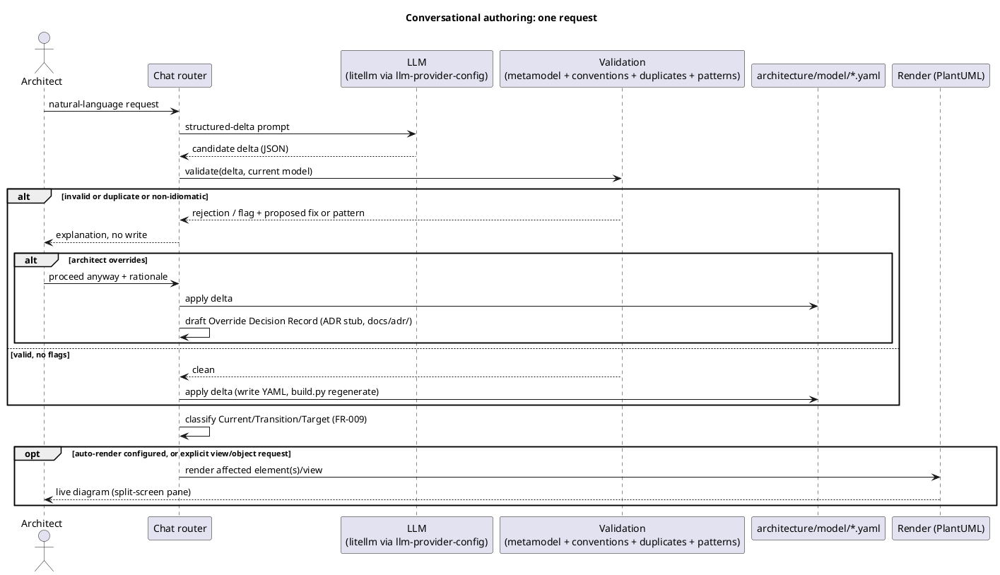

# API Contract: Conversational Model Authoring

Mounted FastAPI router (ADR-0020), `platform/packages/modelling-specification`'s
`router.py`. Entity shapes are defined once in [data-model.md](../data-model.md); this
contract gives the endpoint surface and one example each.

## Request flow (User Story 1 + 2)



The endpoints below are this flow's wire contract.

## POST /authoring/sessions

Starts a session. Returns `session_id`, used by every other call below.

```json
{ "session_id": "a1b2c3" }
```

## POST /authoring/sessions/{session_id}/propose

- **Body**: `{ "request": "add a new application function for X under subsystem Y, served to the EA role" }`
- **Response (200)** — clean (US1 Scenario 1):
  ```json
  { "delta_id": "d1", "status": "validated", "elements": [...], "relationships": [...] }
  ```
- **Response (200)** — flagged (US2 Scenarios 1–3):
  ```json
  {
    "delta_id": "d2",
    "status": "flagged",
    "validation_result": { "clean": false, "findings": [{"rule": "...", "detail": "...", "proposed_fix": "..."}] },
    "duplicates": [{"existing_element_id": "fn-...", "matched_fields": ["name", "description"]}],
    "pattern_suggestions": [{"proposed_relationship": {...}, "established_pattern": {"intermediary_types": ["Artifact"]}}]
  }
  ```
- **Error (502)**: the LLM call failed or returned an unparseable delta — no Candidate Delta is created; the architect is told to rephrase.

## POST /authoring/sessions/{session_id}/deltas/{delta_id}/decide

Covers every explicit decision point: applying a clean delta, keep-both/merge/reject on a
duplicate, accept-pattern/keep-direct on a pattern suggestion, or overriding a rejection.

- **Body (apply a clean delta)**: `{ "action": "apply" }`
- **Body (duplicate decision)**: `{ "action": "merge", "duplicate_decision": "merge", "target_existing_id": "fn-..." }`
- **Body (override, FR-014)**: `{ "action": "override", "rationale": "legacy naming predates the convention" }` — `rationale` is optional (R11)
- **Response (200)**:
  ```json
  { "delta_id": "d1", "status": "applied", "state_classification": "Transition", "override_decision_id": null }
  ```
  `override_decision_id` is the auto-drafted ADR stub's number (R7, e.g. `"0037"`); `null` when no objection was overridden.
- **Error (409)**: `delta_id` is not in `flagged`/`validated` status (already applied or discarded) — the UI should re-propose.
- **Error (422)**: ambiguous state classification (US3 Scenario 2) — response carries `{"needs": "state_classification"}`; resubmit with `{ "action": "apply", "state_classification": "Transition" }`.

## GET /authoring/sessions/{session_id}/deltas/{delta_id}/state

Queryable classification lookup (FR-010).

```json
{ "applies_to": "fn-example", "value": "Transition" }
```

## GET /authoring/render

- **Query**: `object_id` (name an element/view directly) or `description` (resolve a View Request)
- **Response (200)**: `{ "view_id": "...", "svg": "<svg>...</svg>" }` — rendered fresh from the current `architecture/model/` state (FR-013), regardless of auto-render configuration
- **Response (300, Edge Case 2)**: `{ "ambiguous_candidates": ["view-a", "view-b"] }` when the description resolves to more than one plausible view
- **Response (404)**: no view resolves at all

## GET /authoring/config

Read the auto-render-vs-on-request toggle (FR-011).

```json
{ "auto_render": false }
```

## PUT /authoring/config

- **Body**: `{ "auto_render": true }`
- **Response (200)**: echoes the new config. Taking effect: the next `decide` call with `action: "apply"` triggers an automatic `GET /authoring/render` server-side and includes its result inline, instead of the UI having to call render itself (FR-012).
