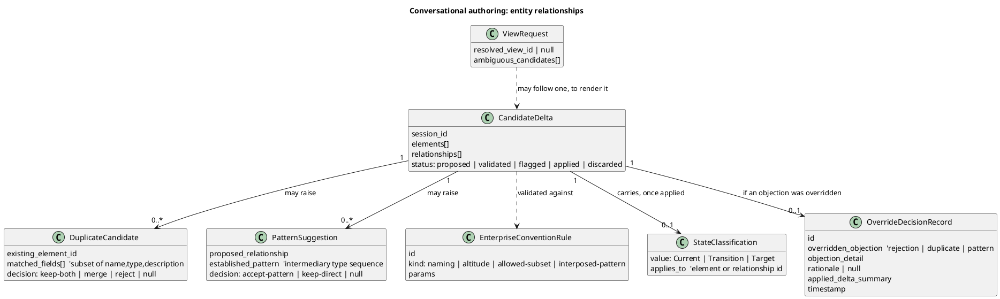
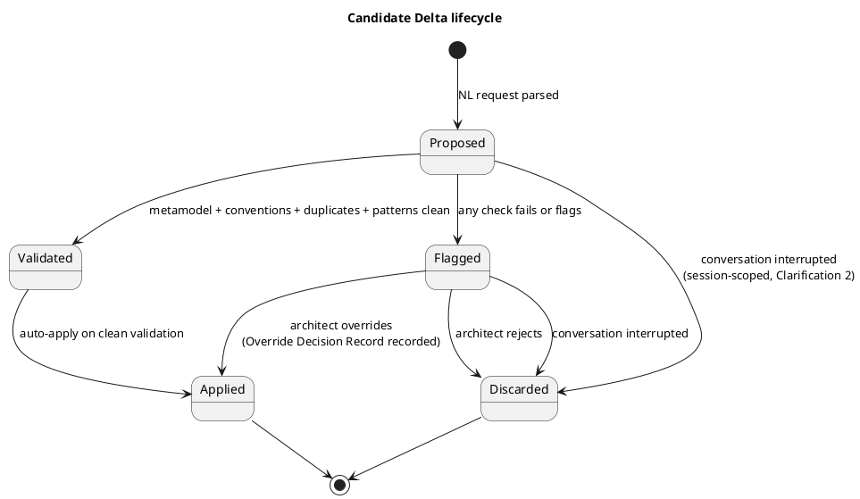

# Data Model: Conversational ArchiMate Model Authoring

Entity fields, ids, validation rules and lifecycles for the seven Key Entities named in
`spec.md`. ArchiMate model ids added by this feature are listed once here and in `plan.md`'s
"Model impact" (not duplicated elsewhere, per Principle XI).

## Overview

## Candidate Delta

Concept and `do-candidate-arch` mapping: spec.md Key Entities. Fields:

| Field | Type | Notes |
|---|---|---|
| `session_id` | string | Issued by the chat router; scopes in-memory storage (R8) |
| `elements[]` | list of `{type, id?, name, desc?, props?}` | `id` absent until the LLM proposes one or validation assigns one; shape matches `elements.yaml`'s own schema |
| `relationships[]` | list of `{type, source, target, label?}` | Same shape as `relationships.yaml` |
| `status` | enum | `proposed → validated/flagged → applied/discarded` — see lifecycle below |
| `validation_result` | `{clean: bool, findings[]}` | From the metamodel + convention checks (R9); one finding per violated rule, each naming the rule and a proposed fix (FR-004) |
| `duplicates[]` | `DuplicateCandidate[]` | Empty unless FR-005 flags something |
| `pattern_suggestions[]` | `PatternSuggestion[]` | Empty unless FR-008 flags something |
| `state_classification` | `Current \| Transition \| Target` | Set on apply (FR-009); `null` while proposed |

**Lifecycle**:

Discarded and Applied are terminal; a discarded delta is never resumed (R8).

## Enterprise Convention Rule

Concept: spec.md Key Entities. **New persistent surface** — lives in
`architecture/model/conventions.yaml`, alongside `store-frameworks` (new artifact
`do-convention-rules`, Assumption 2).

| Field | Type | Notes |
|---|---|---|
| `id` | string | e.g. `conv-naming-camel-free` |
| `kind` | enum | `naming \| altitude \| allowed-subset \| interposed-pattern` |
| `scope` | list of ArchiMate types or `*` | What this rule applies to |
| `params` | kind-specific | E.g. for `interposed-pattern`: `{source_type, relationship_type, target_type, intermediary_types[]}` (R6) |
| `enabled` | bool | Default `true`; organisation can turn a rule off without deleting it |

`conventions.py` (R6) loads this file once per validation call; a malformed entry fails the
load with the offending `id`, never silently skipped (consistent with FR-007's "never
silently" posture).

## Duplicate Candidate

Existing element/relationship flagged under the FR-005 match rule.

| Field | Type | Notes |
|---|---|---|
| `existing_element_id` | string | The id already in `architecture/model/` |
| `matched_fields[]` | subset of `{name, type, description}` | Must contain ≥2 entries to exist at all (R5) — `type` only on exact match, `name`/`description` via `rapidfuzz.fuzz.token_sort_ratio ≥ 80` |
| `decision` | `keep-both \| merge \| reject \| null` | `null` until the architect decides (FR-006); nothing applies while `null` |

A duplicate in a different Current/Transition/Target state (Edge Case 3) is still flagged —
the match rule does not consider state, leaving the keep-both/merge/reject call, including
"this is a legitimate Plateau variant, keep both," to the architect, not the system.

## Pattern Suggestion

Flagged case where a proposed direct relationship could use an established
intermediary-element pattern instead (FR-008). Not itself a duplicate.

| Field | Type | Notes |
|---|---|---|
| `proposed_relationship` | `{type, source, target}` | The direct form the architect described |
| `established_pattern` | `{intermediary_types[]}` | From the matching `interposed-pattern` convention rule (R6) |
| `decision` | `accept-pattern \| keep-direct \| null` | `null` until the architect decides; `keep-direct` applies the originally proposed direct form (it is legal, just non-idiomatic) |

When no `interposed-pattern` rule matches the proposed shape (Edge Case 4 — no established
pattern exists yet), no Pattern Suggestion is raised and the direct relationship is validated
normally; the absence of a pattern is not itself a Validation finding.

## State Classification

Concept and `bo-*-state-architecture` mapping: spec.md Key Entities. Fields:

| Field | Type | Notes |
|---|---|---|
| `value` | `Current \| Transition \| Target` | Required on apply (FR-009); the agent asks rather than guessing when ambiguous (US3 Scenario 2) |
| `applies_to` | element or relationship id | The thing just applied |

Queryable afterward (FR-010) means: given an applied element/relationship id, the chat router
can answer with the `value` recorded at apply time — a lookup over applied Candidate Deltas'
`state_classification`, not a separate store.

## View Request

Concept and `views.yaml` mapping: spec.md Key Entities. Fields:

| Field | Type | Notes |
|---|---|---|
| `resolved_view_id` | string or `null` | A `views.yaml` id, once resolved |
| `ambiguous_candidates[]` | list of view ids | Populated when the request resolves to more than one plausible view (Edge Case 2); the agent asks rather than picking one |

## Override Decision Record

Concept: spec.md Key Entities. **New persistent surface** (Constitution Principle X) — an
auto-drafted `Status: Proposed` ADR stub under `docs/adr/`, not a `store-ledger` entry (R7):
architecture-decision traceability stays on the ADR log, separate from the controls/compliance
evidence `store-ledger` backs. `adr-auditor`'s normal sweep picks the stub up for review.

| Field | Type | Notes |
|---|---|---|
| `id` | string | ADR number assigned on draft, e.g. `0037` |
| `overridden_objection` | `rejection \| duplicate \| pattern` | Which of FR-004/FR-006/FR-008's objections was overridden |
| `objection_detail` | string | The specific rule/duplicate/pattern the agent cited |
| `rationale` | string or `null` | Architect's stated reason; `null` when none was given (R11, Edge Case 7) |
| `applied_delta_summary` | string | What was actually applied once overridden |
| `timestamp` | ISO 8601 | Draft time |

## Invariants (asserted by tests)

1. No Candidate Delta reaches `applied` status without `validation_result.clean == true` or an Override Decision Record.
2. Every `applied` Candidate Delta carries a non-null `state_classification`.
3. A Duplicate Candidate always has ≥2 `matched_fields`; fewer than 2 means no Duplicate Candidate is raised at all.
4. A Pattern Suggestion is raised only when a `conventions.yaml` `interposed-pattern` rule matches the proposed shape exactly.
5. `architecture/model/conventions.yaml` round-trips through `yaml.safe_load`/`safe_dump` with no information loss.
6. An Override Decision Record's `applied_delta_summary` names only elements/relationships that were in fact written to `architecture/model/` in the same apply.
7. A `discarded` Candidate Delta is never read back in a later session (no resume path exists in code).
