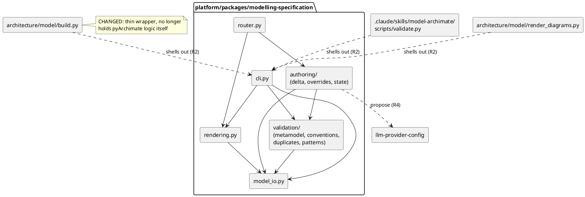

# Implementation Plan: Conversational ArchiMate Model Authoring

**Branch**: `feature/gh-108-conversational-architecture-agent` (issue #108) | **Date**: 2026-10-08 | **Spec**: [spec.md](spec.md)

**Input**: Feature specification from `specs/004-conversational-model-authoring/spec.md`

## Summary

A new `platform/packages/modelling-specification` package (subsystem 6, ADR-0011; already
named `art-pkg-modelling-specification` in the model) hosts the conversational agent: an LLM
call (via `llm-provider-config`/`litellm`, ADR-0034) turns an architect's natural-language
request into a structured candidate delta, which a shared validation module — metamodel
checks via pyArchimate plus configurable Enterprise Convention Rules — accepts or rejects
before anything touches `architecture/model/`. The same package also absorbs
`architecture/model/build.py`'s load/merge/validate logic and `render_diagrams.py`'s
view-render logic; root's `build.py`, `render_diagrams.py` and the skill's `validate.py`
become thin wrappers shelling into it, so CI and the vendored/generated YAML layers (ADR-0029,
ADR-0035) keep one deterministic, non-conversational pipeline rather than a second
implementation (R2). A FastAPI router, mounted per ADR-0020, serves the chat turn and a render
endpoint the split-screen UI polls after apply or on request (FR-011–FR-013). Entities, ids
and lifecycles are in [data-model.md](data-model.md); decisions in [research.md](research.md).
The business-layer wiring Assumption 6 defers to this plan is in "Model impact" below, to be
filed as ADR-0036 before `/speckit-tasks`.

## Technical Context

**Language/Version**: Python 3.12 (floor `>=3.11,<3.14`), matching `platform/pyproject.toml`

**Primary Dependencies**: FastAPI + uvicorn (existing stack); `pyarchimate` promoted from a
root dev-only dependency to a runtime dependency of the new package; `rapidfuzz` (already a
root **test**-only dependency, promoted to runtime here) for FR-005 duplicate matching;
`llm-provider-config` + `litellm` (ADR-0034, same pattern as `controls-compliance-catalog`)
for the natural language-to-delta call; `pyyaml` for Enterprise Convention Rule config and model-delta
read/write, matching `architecture/model/build.py`'s own YAML authoring

**Storage**: `architecture/model/*.yaml` for applied changes (regenerated via `build.py`'s
logic, now ported into the package per R2, never hand-edited); new
`architecture/model/conventions.yaml` for Enterprise
Convention Rules (new persistent surface, Assumption 2); Override Decision Records appended
to the existing Forensic Audit Ledger (`store-ledger`) rather than a new store. Candidate
Deltas are **in-process memory only**, keyed by conversation/session id — no database, per the
session-scoped Clarification and the single-user-local MVP (ADR-0024)

**Testing**: `pytest` + `pytest-mock` for the validation module and LLM-call seam (fake
`litellm.completion`, mirroring `llm-provider-config`'s own test pattern — no live network);
`httpx` contract tests against the mounted FastAPI router (existing `tests/api/` pattern);
`behave` scenarios for the three User Stories' acceptance scenarios (`acceptance-author`)

**Target Platform**: Same host as the existing visualiser — Linux server / devcontainer,
FastAPI + uvicorn; UI is a mounted fragment in the browser (ADR-0020), not a new app

**Project Type**: Web service — new `platform/packages/modelling-specification` package
(ADR-0002 monorepo path-dependency pattern, mirroring `controls-compliance-catalog`), **not**
`src/frictionless_architect`: the model already names this package (`art-pkg-modelling-specification`,
status "build") as subsystem 6's home, and `src/` is the pre-migration flat layout
(`ARCHITECTURE.md` §8) new subsystem code does not join

**Performance Goals**: No explicit NFR in the spec; SC-001–SC-005 are correctness criteria,
not latency ones. Principle IV's 200ms rule does not bind an LLM round-trip — deferred to
`NONFUNCTIONALS.md` only if it later proves load-bearing

**Constraints**: Validate before apply, every time (FR-002/003) — a candidate delta is
checked against an in-memory merge of the current model, never written to `architecture/model/`
until accepted; never silently apply, autocorrect or drop (FR-004/007); session-scoped state
only, nothing resumes after an interruption (Clarification 2); single architect at a time
(Assumption 5, ADR-0024)

**Scale/Scope**: One architect, one conversation at a time; current model is 416 elements /
852 relationships / 49 views (`build.py` output, 2026-10-08) — validation runs against that
scale, not a multi-tenant one

## Constitution Check

*GATE: passed before Phase 0; re-checked after Phase 1 — still passes.*

| Principle | Assessment |
|---|---|
| I. Code Quality | Validation, duplicate-check, pattern-check and LLM-call are separate pure-ish functions over the in-memory model merge; no single function spans more than one concern. Pass. |
| II. Testing | TDD order in tasks: validation-module unit tests (fixture deltas) before the FastAPI contract tests before behave. New package carries its own 90% gate via `scripts/platform_checks.sh`. Pass. |
| III. UX Consistency | Rejections carry the specific rule and a proposed fix (FR-004); duplicate/pattern flags use the same keep/merge/reject decision shape in both cases. Pass. |
| IV. Performance | N/A — no hot path; LLM latency is inherent to the feature, not a regression to guard. Pass. |
| V. Security | No new secret handling: the LLM call reuses `llm-provider-config`'s keyring-backed credential resolution (ADR-0034) rather than a new path. NL input is never interpolated into a shell call or raw SQL/Cypher; it only ever becomes structured delta fields validated against the metamodel. Pass. |
| VI. State Mgmt | Candidate Delta lifecycle (proposed → validated/rejected → accepted/overridden/discarded) is a documented state machine in `data-model.md`. Pass. |
| VII. Integrity | Every candidate is validated against the same pyArchimate checks `build.py`/`validate.py` already enforce, before, not after, it reaches `architecture/model/`. Pass. |
| VIII. Durability | Applied changes land in the existing YAML schema (ADR-0007/0008) via the existing regeneration path; no new on-disk format for the model itself. Pass. |
| IX. Cross-Platform | FastAPI/Python, no OS-specific paths beyond what the existing visualiser already assumes. Pass. |
| X. Decision Traceability | Model impact stated below; **ADR-0036 required** before `/speckit-tasks` for: package location, validation-module incorporation (shared between the skill and the app without forking, Assumption 1), Enterprise Convention Rule config surface, Override Decision Record reusing `store-ledger`, and the business-layer/ValueStream wiring (Assumption 6). Tracked as a plan follow-up, not yet filed. |
| XI. Concise Artefacts | Entity detail lives only in `data-model.md`; this plan links to it rather than restating fields. |

No violations; Complexity Tracking is empty — a new platform package is the sanctioned
structure (ADR-0002/0011), not a deviation needing justification.

### Model impact

New elements (`architecture/model/elements.yaml`):

| Type | Id | Name |
|---|---|---|
| ValueStream | `vs-intent-to-model` | Intent to Model |
| Outcome | `outcome-architect-authored-model` | Architect-Authored Model Changes |
| BusinessProcess | `process-conversational-authoring` | Conversational Model Authoring |
| DataObject | `art-convention-rules` | Enterprise Convention Rules |
| DataObject | `art-override-decision` | Override Decision Record |

New relationships (`architecture/model/relationships.yaml`):

- `Serving coa-executable-governance → vs-intent-to-model` and `Association stk-architecture → vs-intent-to-model` (same pattern as the other four outcome streams)
- `Realization vs-intent-to-model → outcome-architect-authored-model`
- `Serving cap-conversational-governance → vs-intent-to-model` (capability serves the stream)
- `Realization process-conversational-authoring → cap-conversational-governance`
- `Realization fn-conversational-authoring → process-conversational-authoring` (the settled app function now realizes a business process, resolving Assumption 6)
- `Serving process-conversational-authoring → role-ea` and `→ role-sa` (shared standing process, not per-role ad hoc)
- `Aggregation store-frameworks → art-convention-rules` (same pattern as `art-metamodel`)
- `Aggregation store-ledger → art-override-decision` (same pattern as `art-ledger-entry` — reuses the Forensic Audit Ledger rather than a new store)
- `Access fn-conversational-authoring → art-convention-rules` (Read), `Access fn-conversational-authoring → art-override-decision` (Write)

No existing element, relationship or view is retired or renamed. `tasks.md` carries the YAML
edits, `build.py` regeneration and `validate.py`/shared-module re-check (Principle X).

## Project Structure

### Documentation (this feature)

```text
specs/004-conversational-model-authoring/
├── plan.md, research.md, data-model.md, quickstart.md
├── contracts/api.md
├── checklists/requirements.md
└── tasks.md             # Phase 2 — /speckit-tasks (not created here)
```

### Source Code (repository root)

New package `platform/packages/modelling-specification` (`art-pkg-modelling-specification`),
built like `controls-compliance-catalog`: own `pyproject.toml` (fastapi, pyarchimate,
rapidfuzz, `llm-provider-config` path dep, litellm, pyyaml), `src/`, `tests/unit/`, `specs/`.
Internal module layout and the three root wrappers it replaces:



Also changed: `architecture/model/conventions.yaml` (NEW, Enterprise Convention Rules);
`elements.yaml`/`relationships.yaml` (see "Model impact"); `diagrams/strategy/`,
`diagrams/business/` (regenerated); root `pyproject.toml` (drops `pyarchimate`/`rapidfuzz`
entirely once the three scripts above are thin wrappers, R2); `docs/adr/0036-*.md` (NEW,
filed before `/speckit-tasks`) and `docs/adr/README.md` (index row).

**Structure Decision**: New platform package, not `src/frictionless_architect` — the model
already designates `art-pkg-modelling-specification` as subsystem 6's home and ADR-0002's
monorepo pattern (own `pyproject.toml`/`src/`/`tests/`/`specs/`, path dependency on
`llm-provider-config`) is the established way to add it, mirroring
`controls-compliance-catalog`. The skill script and root's `build.py`/`render_diagrams.py` all
become thin callers into the platform venv rather than each holding a separate implementation
(R2) — CI and the vendored/generated YAML layers (ADR-0029, ADR-0035) still run the same
deterministic pipeline, now with one home instead of three.

## Complexity Tracking

No constitution violations to justify.
