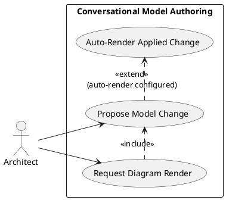
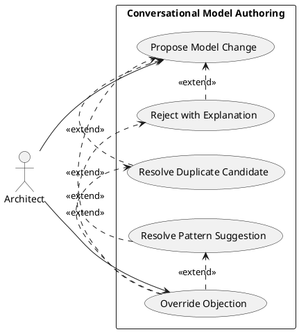
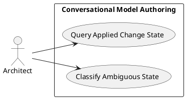

# Feature Specification: Conversational ArchiMate Model Authoring

**Feature Branch**: `feature/gh-108-conversational-architecture-agent`

**Created**: 2026-10-08

**Status**: Draft

**Input**: User description: "Add a conversational AI agent for iteratively authoring the ArchiMate architecture model. An architect describes an intent in natural language; the agent proposes a candidate model delta, validates it against the model-archimate skill's metamodel checks plus configurable enterprise/domain conventions, and on pass renders the affected element(s)/view live in a split-screen UI. On failure it explains the violation and proposes a fix. Duplicate candidates are flagged for an explicit keep/merge/reject decision. Every applied change is classified Current/Transition/Target. Multi-user collaboration and RBAC are out of scope (tracked as GH #83)." (GH #108)

## Clarifications

### Session 2026-10-08

- Q: When checking a proposed element against existing ones, how strict should the "likely duplicate" match be before it's flagged? → A: Fuzzy match across name, type, and description together — any two of the three being similar triggers a flag.
- Q: If the architect closes or interrupts the conversation while a candidate delta is still pending, does it survive to the next session? → A: Session-scoped only — an interrupted session's pending delta is discarded; the architect re-describes it next time.

## User Scenarios & Testing *(mandatory)*

### User Story 1 - Propose and see a validated change (Priority: P1)

An enterprise or solution architect describes a model change in plain language (e.g. "add a new application function for X under subsystem Y, served to the EA role"). The agent proposes the model delta, validates it against the ArchiMate metamodel and the configured enterprise conventions, and — once it passes — renders the affected element(s) in a live diagram next to the conversation, without the architect hand-editing any model file or manually re-running a render step.

**Why this priority**: This is the feature's core loop; without it there is no conversational authoring capability at all.

**Independent Test**: Describe a single well-formed change in conversation and confirm a diagram reflecting it appears without any manual file edit or render command.

**Acceptance Scenarios**:

1. **Given** an architect describes a valid, unambiguous model change, **When** the agent proposes the delta, **Then** it validates cleanly against the metamodel and configured conventions and is applied.
2. **Given** a change has just been applied and rendering is configured to happen automatically, **When** the change is applied, **Then** the corresponding diagram renders immediately without the architect asking.
3. **Given** a change has just been applied and rendering is configured to happen on request, **When** the architect asks to see the affected element or a described view, **Then** the corresponding diagram renders immediately, reflecting the current state of the conversation.

---

### User Story 2 - Reject invalid, duplicate, or non-idiomatic proposals with an explanation (Priority: P1)

Invalid, duplicate, and non-idiomatic proposals are never applied, auto-corrected, or dropped silently — each requires an explicit architect decision, and an overridden objection is recorded for later review. Mechanics are in the Acceptance Scenarios and Functional Requirements below.

**Why this priority**: Without this, the agent cannot be trusted to touch the canonical model — the same concern that makes conversational authoring risky in the first place.

**Independent Test**: Describe a change that breaks a metamodel rule, one that duplicates an existing element, and one that proposes a direct relationship where the model's convention is to interpose intermediary elements; confirm all three produce an explanation and none is applied without an explicit decision.

**Acceptance Scenarios**:

1. **Given** a proposed change violates a metamodel rule or a configured convention, **When** the agent validates it, **Then** it rejects the change with a specific, actionable explanation and proposes a fix instead of applying, autocorrecting, or dropping it silently.
2. **Given** a proposed element or relationship resembles an existing one by name, type, or description, **When** the agent checks for duplicates, **Then** it surfaces the candidate(s) and waits for an explicit keep-both, merge, or reject decision before applying anything.
3. **Given** a proposed direct relationship is legal per the metamodel but the model's established pattern normally interposes intermediary element(s) for that relationship shape, **When** the agent checks it, **Then** it flags the shortcut, explains the established pattern, and proposes the intermediary-element form as an alternative, requiring an explicit decision before applying the direct form.
4. **Given** the agent has rejected a change, flagged a duplicate, or suggested a pattern alternative, **When** the architect explicitly overrides that objection and proceeds anyway, **Then** the agent applies the change and records the override — what was overridden, the agent's objection, and the architect's rationale — as a traceable decision for later review.

---

### User Story 3 - Track and query Current/Transition/Target state (Priority: P2)

Every applied change is classified Current, Transition, or Target, and that classification is queryable afterward. Mechanics are in the Acceptance Scenarios and Functional Requirements below.

**Why this priority**: Valuable and explicitly required by the issue, but the conversational loop (P1) delivers value even before state querying is wired up end to end.

**Independent Test**: Apply a change while specifying its state, then ask the agent what state that change belongs to, independent of any other feature in this spec.

**Acceptance Scenarios**:

1. **Given** an applied change, **When** the architect asks what state it belongs to, **Then** the agent answers Current, Transition, or Target consistent with what was recorded when the change was applied.
2. **Given** a change that is ambiguous about state, **When** the agent processes it, **Then** it asks the architect to classify it rather than guessing.

---

### Edge Cases

- What happens when a proposed change touches an element or relationship already modified earlier in the same conversation but not yet applied?
- How does the agent handle a described view request that resolves to more than one plausible existing view, or to no existing view at all?
- What happens when a duplicate candidate exists in a different Current/Transition/Target state than the proposed change — is that a duplicate at all, or a legitimate Plateau variant?
- What happens when a proposed direct relationship is legal per the metamodel but no established intermediary-element pattern exists yet for that relationship shape — is it applied as-is, or does the absence of a pattern itself need a decision?
- How does the agent handle a change request that is valid on its own but would break an existing element's referential integrity elsewhere in the model?
- What happens when the architect rejects the agent's proposed fix for a rejected change — does the agent retry, ask again, or drop the request?
- What happens when the architect overrides an objection without giving a rationale — does the agent require one before recording the override, or record it as absent?
- What happens to a pending (proposed but not yet decided) candidate delta if the conversation is closed or interrupted before the architect accepts, rejects, or revises it?

## Requirements *(mandatory)*

### Functional Requirements

- **FR-001**: The agent MUST accept a natural-language description of an intended model change and propose a candidate model delta from it.
- **FR-002**: The agent MUST validate every candidate delta against the ArchiMate metamodel (relationship-matrix legality and referential integrity) before it is applied.
- **FR-003**: The agent MUST validate every candidate delta against a configurable set of enterprise/domain conventions, separate from and in addition to the fixed ArchiMate metamodel rules.
- **FR-004**: When a candidate delta fails metamodel or convention validation, the agent MUST reject it with a specific, actionable explanation of which rule it violated, and propose a corrected alternative rather than applying, auto-correcting, or dropping it silently.
- **FR-005**: Before applying a new element or relationship, the agent MUST check it against existing elements for likely duplicates, flagging a candidate when at least two of name, type, and description are similar to an existing element.
- **FR-006**: When a likely duplicate is found, the agent MUST present the candidate duplicate(s) to the architect and require an explicit keep-both, merge, or reject decision before applying anything.
- **FR-007**: The agent MUST NOT silently deduplicate or silently create a duplicate under any circumstance.
- **FR-008**: Before applying a direct relationship, the agent MUST check whether the model's established authoring conventions normally interpose intermediary element(s) for that relationship shape, and if so, flag it and propose the intermediary-element alternative, requiring an explicit decision before applying the direct form.
- **FR-009**: Every change the agent applies MUST be classified as Current, Transition, or Target state.
- **FR-010**: The classification of an applied change MUST remain queryable after the fact.
- **FR-011**: Whether a diagram renders automatically after every applied change, or only on an explicit view/object request, MUST be a configurable choice, not a hardcoded behavior.
- **FR-012**: When configured for automatic rendering, the agent MUST render the affected element(s) as a live diagram immediately after a change is applied, without a manual render step.
- **FR-013**: The agent MUST render a diagram for an explicitly requested object or described view without a manual render step, reflecting the model's state at the time of the request, regardless of the automatic-rendering configuration.
- **FR-014**: When an architect overrides the agent's rejection, duplicate flag, or pattern suggestion and proceeds anyway, the agent MUST record the override as a traceable decision — what was overridden, the agent's original objection, and the architect's rationale — for later review, rather than discarding it once applied.

### Key Entities *(include if feature involves data)*

- **Candidate Delta**: A proposed, not-yet-applied set of model element/relationship additions or changes derived from one natural-language request; carries its own validation and duplicate-check outcome until the architect accepts, rejects, or revises it. Session-scoped — if the conversation is closed or interrupted first, the pending delta is discarded, not resumed. Maps to the model's existing `do-candidate-arch` data object.
- **Enterprise Convention Rule**: A configurable rule (naming, altitude-of-language, allowed element subset, interposed-element patterns, etc.) checked in addition to the fixed ArchiMate metamodel rules; organisation-specific and editable, unlike the metamodel rules. New model surface — see Assumptions.
- **Duplicate Candidate**: An existing element or relationship flagged under the FR-005 match rule as plausibly the same real-world thing as a proposed one; requires an explicit keep-both, merge, or reject decision.
- **Pattern Suggestion**: A flagged case where a proposed direct relationship could be expressed more faithfully via an established intermediary-element pattern already used elsewhere in the model; requires an analogous explicit decision, but is not itself a duplicate.
- **State Classification**: The Current, Transition, or Target tag attached to an applied change, consistent with the model's existing `bo-current-state-architecture` / `bo-transition-state-architecture` / `bo-target-state-architecture` analogues.
- **View Request**: An architect's request — by naming an existing object or describing a scope — that resolves to a diagram to render live, against the model's existing `views.yaml` entries.
- **Override Decision Record**: What was overridden, the agent's original objection, and the architect's rationale, captured when an architect proceeds against the agent's objection. Load-bearing by definition (Constitution Principle X) — expect an ADR draft.

Of these, only **Enterprise Convention Rule** and **Override Decision Record** are new persistent surface; the rest map to elements, business objects, artifacts, or views already in `architecture/model/`, or are transient (never persisted).

## Success Criteria *(mandatory)*

### Measurable Outcomes

- **SC-001**: An architect can go from describing an intent to seeing a validated, rendered diagram of the resulting change without hand-editing a model file or manually running a render command.
- **SC-002**: 100% of proposed changes that violate the ArchiMate metamodel or a configured enterprise convention are rejected with a specific explanation; none are applied, auto-corrected, or dropped silently.
- **SC-003**: 100% of proposed elements or relationships flagged as likely duplicates require an explicit keep-both, merge, or reject decision before being applied.
- **SC-004**: Every change applied through this feature carries a Current, Transition, or Target classification that is retrievable afterward, for 100% of applied changes.
- **SC-005**: Requesting an existing object or describing a custom view renders the matching diagram without any manual render step, in 100% of requests that resolve unambiguously.

## Assumptions

- The pyArchimate-based metamodel validation (relationship-matrix legality, referential integrity) currently implemented only in the model-archimate skill's scripts is incorporated into the application codebase as a shared module, so the running agent can call it directly rather than depending on a Claude-Code-specific skill invocation; the skill continues to use the same incorporated logic for developer-facing authoring, so the checks are never forked into two copies.
- Enterprise convention rules are expressed in a configuration format living alongside `store-frameworks`, consistent with the rest of the canonical model's YAML-based authoring; this ruleset is new model surface this feature introduces (see Key Entities), not a repurposing of an existing element.
- The capability/function placement already landed in `architecture/model/` on this feature branch — `fn-conversational-authoring` under `sub-modelling`, realizing `cap-conversational-governance` (Serving `cap-spec-engine`, Associated with `cap-digital-twin`) — is settled and out of scope to re-decide here.
- Duplicate detection operates against elements already committed to `architecture/model/`; detecting conflicts between two not-yet-applied deltas within the same conversation is handled by the normal propose-validate-apply sequence (FR-001–FR-004), not a separate mechanism.
- This feature operates for a single architect at a time. Real-time multi-user collaboration and RBAC on model edits are out of scope and tracked separately under GH #83 (`bc-model-collaboration`); this feature is built so that layer can sit underneath it later without rework.
- Resolved during specification: conversational authoring routes through a new standing business-layer process/function shared by `role-ea`/`role-sa` (rather than being served directly to each role at the component level), owned by a new ValueStream. This is a model-structure decision, not a testable functional requirement, so it is recorded here rather than as an FR; `plan.md`'s model-impact statement is the single place its ids and wiring are specified (Principle XI).
